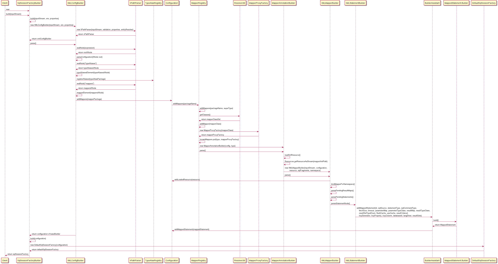

# Dive Into MyBatis Source Code

## How Mapper Interface Bind XML Mapping File?

### Load `mybatis-config.xml`, mapper interface and mapper xml



### Get mapper instance by JDK dynamic proxy from Map `knowMappers` with class type 

`MapperRegistry.java`

```java
public class MapperRegistry {

  public <T> T getMapper(Class<T> type, SqlSession sqlSession) {
    final MapperProxyFactory<T> mapperProxyFactory = (MapperProxyFactory<T>) knownMappers.get(type);
	...
    return mapperProxyFactory.newInstance(sqlSession);
  }
}
```

`MapperProxyFactory.java`

```java
public class MapperProxyFactory<T> {
    
  public T newInstance(SqlSession sqlSession) {
    final MapperProxy<T> mapperProxy = new MapperProxy<>(sqlSession, mapperInterface, methodCache);
    return newInstance(mapperProxy);
  }
  
  protected T newInstance(MapperProxy<T> mapperProxy) {
    return (T) Proxy.newProxyInstance(mapperInterface.getClassLoader(), new Class[] { mapperInterface }, mapperProxy);
  }
}
```

### Call Mapper Proxy Instance methods

TODO


---


## How Maper Interface Bind SQL Annotations?

public class MapperAnnotationBuilder => parser

org.apache.ibatis.binding.MapperRegistry.java

```java
public class MapperRegistry {
  
  private final Map<Class<?>, MapperProxyFactory<?>> knownMappers = new HashMap<>();

  public <T> void addMapper(Class<T> type) {
    if (type.isInterface()) {
      if (hasMapper(type)) {
        throw new BindingException("Type " + type + " is already known to the MapperRegistry.");
      }
      boolean loadCompleted = false;
      try {
        knownMappers.put(type, new MapperProxyFactory<>(type));
        // It's important that the type is added before the parser is run
        // otherwise the binding may automatically be attempted by the
        // mapper parser. If the type is already known, it won't try.
        MapperAnnotationBuilder parser = new MapperAnnotationBuilder(config, type);
        parser.parse();
        loadCompleted = true;
      } finally {
        if (!loadCompleted) {
          knownMappers.remove(type);
        }
      }
    }
  }
}
```

`org.ibatis.binding.MapperProxyFactory.java`

```java
public class MapperProxyFactory<T> {

  private final Class<T> mapperInterface;
  private final Map<Method, MapperMethodInvoker> methodCache = new ConcurrentHashMap<>();

}
```

`org.ibatis.builder.annotation.MapperAnnotationBuilder.java`

```java
public class MapperAnnotationBuilder {
  public void parse() {
    String resource = type.toString();
    if (!configuration.isResourceLoaded(resource)) {
      loadXmlResource();
      configuration.addLoadedResource(resource);
      assistant.setCurrentNamespace(type.getName());
      parseCache();
      parseCacheRef();
      for (Method method : type.getMethods()) {
        if (!canHaveStatement(method)) {
          continue;
        }
        if (getAnnotationWrapper(method, false, Select.class, SelectProvider.class).isPresent()
            && method.getAnnotation(ResultMap.class) == null) {
          parseResultMap(method);
        }
        try {
          parseStatement(method);
        } catch (IncompleteElementException e) {
          configuration.addIncompleteMethod(new MethodResolver(this, method));
        }
      }
    }
    parsePendingMethods();
  }
  
  private void loadXmlResource() {
    // Spring may not know the real resource name so we check a flag
    // to prevent loading again a resource twice
    // this flag is set at XMLMapperBuilder#bindMapperForNamespace
    if (!configuration.isResourceLoaded("namespace:" + type.getName())) {
      String xmlResource = type.getName().replace('.', '/') + ".xml";
      // #1347
      InputStream inputStream = type.getResourceAsStream("/" + xmlResource);
      if (inputStream == null) {
        // Search XML mapper that is not in the module but in the classpath.
        try {
          inputStream = Resources.getResourceAsStream(type.getClassLoader(), xmlResource);
        } catch (IOException e2) {
          // ignore, resource is not required
        }
      }
      if (inputStream != null) {
        XMLMapperBuilder xmlParser = new XMLMapperBuilder(inputStream, assistant.getConfiguration(), xmlResource, configuration.getSqlFragments(), type.getName());
        xmlParser.parse();
      }
    }
  }

}
```

`org.apache.ibatis.builder.xml.XMLMapperBuilder.java`

```java
public class XMLMapperBuilder extends BaseBuilder {

  private final XPathParser parser;
  private final MapperBuilderAssistant builderAssistant;
  private final Map<String, XNode> sqlFragments;
  private final String resource;

  public XMLMapperBuilder(InputStream inputStream, Configuration configuration, String resource, Map<String, XNode> sqlFragments, String namespace) {
    this(inputStream, configuration, resource, sqlFragments);
    this.builderAssistant.setCurrentNamespace(namespace);
  }

  public void parse() {
    if (!configuration.isResourceLoaded(resource)) {
      configurationElement(parser.evalNode("/mapper"));
      configuration.addLoadedResource(resource);
      bindMapperForNamespace();
    }

    parsePendingResultMaps();
    parsePendingCacheRefs();
    parsePendingStatements();
  }
}
```

