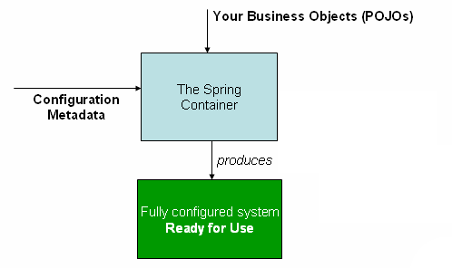

Title: Understanding The Spring Framework Core

**Content**

- Introduction to the Spring Framework
- The IoC container
- Aspect Oriented Programming with Spring
- Spring AOP APIs
- Validation, Data Binding, and Type Conversion

## Introduction to the Spring Framework

### What is the Spring Framework

> The Spring Framework provides a comprehensive programming and configuration model for modern Java-based enterprise applications - on any kind of deployment platform.

> A key element of Spring is infrastructural support at the application level: Spring focuses on the "plumbing" of enterprise applications so that teams can focus on application-level business logic, without unnecessary ties to specific deployment environments.

> The Spring Framework is a Java platform that provides comprehensive infrastructure support for developing Java applications. Spring handles the infrastructure so you can focus on your application.

In my opinion, the Spring framework is a infrastructure framework or a Java application infrastructure platform that does a lot of infrastructure things to help you focus on your application business logic development. In addition, the Spring framework is non-intrusive, meaning that your domain logic code generally has no dependencies on the framework itself.

Features

- Core technologies: dependency injection, events, resources, i18n, validation, data binding, type converion, SpEL, AOP.
- Testing: mock objects, TestContext framework, Spring MVC Test, WebTestClient.
- Data Access: transactions, DAO support, JDBC, ORM, Marshalling XML.
- Spring MVC and Spring WebFlux web frameworks.
- Integration: remoting, JMS, JCA, JMX, email, tasks, scheduling, cache.
- Languages: Kotlin, Groovy, dynamic languages.

### Modules

Core Container

- spring-core. It provides basic classes for exception handling and version detection, and other core helpers that are not specific to any part of the framework. **Core utilities, used by many other Spring modules.**
- spring-beans. It provides the fundamental parts of the framework. The IoC. `BeanFactory`.
  - [org.springframework.beans](https://docs.spring.io/spring-framework/docs/current/javadoc-api/org/springframework/beans/package-summary.html). This package contains interfaces and classes for manipulating Java beans.
  - [org.springframework.beans.annotation](https://docs.spring.io/spring-framework/docs/current/javadoc-api/org/springframework/beans/annotation/package-summary.html). Support package for beans-style handling of Java 5 annotations.
  - [org.springframework.beans.factory](https://docs.spring.io/spring-framework/docs/current/javadoc-api/org/springframework/beans/factory/package-summary.html). The core package implementing Spring's lightweight Inversion of Control (IoC) container.
  - [org.springframework.beans.factory.annotation](https://docs.spring.io/spring-framework/docs/current/javadoc-api/org/springframework/beans/factory/annotation/package-summary.html). Support package for annotation-driven bean configuration.
  - [org.springframework.beans.factory.parsing](https://docs.spring.io/spring-framework/docs/current/javadoc-api/org/springframework/beans/factory/parsing/package-summary.html). Support infrastructure for bean definition parsing.
  - [org.springframework.beans.factory.xml](https://docs.spring.io/spring-framework/docs/current/javadoc-api/org/springframework/beans/factory/xml/package-summary.html). Contains an abstract XML-based `BeanFactory` implementation, including a standard "spring-beans" XSD.
- spring-context. To access objects in a framework-style manner. Provides support for internationalization (using, for example, resource bundles), event propagation, resource loading,  and the transparent creation of contexts by, for example, a Servlet container. The Context module  also supports Java EE features such as EJB, JMX, and basic remoting.`ApplicationContext`.
  - [org.springframework.context](https://docs.spring.io/spring-framework/docs/current/javadoc-api/org/springframework/context/package-summary.html). This package builds on the beans package to add support for message sources and for the Observer design pattern, and the ability for application objects to obtain resources using a consistent API.
- spring-context-support. It provides support for integrating common third-party libraries into a Spring application context. For example, `EhCache`, `Quartz`
- spring-expression. provides a powerful Expression Language for querying and manipulating an object graph at runtime.

AOP

- spring-aop. It provides an AOP Alliance-compliant aspect-oriented programming implementation. Proxy-based AOP support.
  - [org.springframework.aop](https://docs.spring.io/spring-framework/docs/current/javadoc-api/org/springframework/aop/package-summary.html). Core Spring AOP interfaces, built on AOP Alliance AOP interoperability interfaces.
  - [org.springframework.aop.aspectj](https://docs.spring.io/spring-framework/docs/current/javadoc-api/org/springframework/aop/aspectj/package-summary.html). AspectJ integration package.
  - [org.springframework.aop.config](https://docs.spring.io/spring-framework/docs/current/javadoc-api/org/springframework/aop/config/package-summary.html). Support package for declarative AOP configuration, with XML schema being the primary configuration format.
- spring-aspects. It provides integration with AspectJ. AspectJ based aspects.
  - [org.springframework.beans.factory.aspectj](https://docs.spring.io/spring-framework/docs/current/javadoc-api/org/springframework/beans/factory/aspectj/package-summary.html)
  - [org.springframework.cache.aspectj](https://docs.spring.io/spring-framework/docs/current/javadoc-api/org/springframework/cache/aspectj/package-summary.html)
  - [org.springframework.context.annotation.aspectj](https://docs.spring.io/spring-framework/docs/current/javadoc-api/org/springframework/context/annotation/aspectj/package-summary.html)
  - [org.springframework.scheduling.aspectj](https://docs.spring.io/spring-framework/docs/current/javadoc-api/org/springframework/scheduling/aspectj/package-summary.html)
  - [org.springframework.transaction.aspectj](https://docs.spring.io/spring-framework/docs/current/javadoc-api/org/springframework/transaction/aspectj/package-summary.html)
- spring-instrument. It provides class instrumentation support and classloader implementations to be used in certain application servers. 

Messaging

- spring-messaging

Data Access/Integration

- spring-jdbc
- spring-tx
- spring-orm
- spring-oxm
- spring-jms

Web

- spring-web
- spring-webmvc
- spring-websocket

Test

- spring-test

## IoC container

### Ioc Container

**What is IoC?**

IoC is also known as dependency injection (DI). It is a process whereby objects define their dependencies, that is, the other objects they work with, only through constructor arguments, arguments to a factory method, or properties that are set on the object instance after it is constructed or returned from a factory method. The container then injects those dependencies when it creates the bean. This process is fundamentally the inverse, hence the name Inversion of Control (IoC), of the bean itself controlling the instantiation or location of its dependencies by using direct construction of classes, or a mechanism such as the Service Locator pattern.

The `org.springframework.beans` and `org.springframework.context` packages are the basis for Spring Framework’s IoC container. The `BeanFactory` interface provides an advanced configuration mechanism capable of managing any type of object. `ApplicationContext` is a subinterface of `BeanFactory`. It adds easier integration with other Spring features.

In short, the `BeanFactory` provides the configuration framework and basic functionality, and the `ApplicationContext` adds more enterprise-specific functionality.

**What is Bean?**

In Spring, the objects that form the backbone of your application and that are managed by the Spring IoC container are called beans. A bean is an object that is instantiated, assembled, and otherwise managed by a Spring IoC container. Otherwise, a bean is simply one of many objects in your application. Beans, and the dependencies among them, are reflected in the configuration metadata used by a container.

**What is IoC Container?**

IoC container is the implementation of IoC functionality in the Spring framework.

**How IoC container works?**

The interface `org.springframework.context.ApplicationContext`represents the Spring IoC container and is responsible for instantiating, configuring, and assembling the aforementioned beans. The container gets its instructions on what objects to instantiate, configure, and assemble by reading configuration metadata. The configuration metadata is represented in XML, Java annotations, or Java code. It allows you to express the objects that compose your application and the rich interdependencies between such objects.

Several implementations of the ApplicationContext interface are supplied out-of-the-box with Spring. In standalone applications it is common to create an instance of ClassPathXmlApplicationContext or FileSystemXmlApplicationContext. 

The following diagram is a high-level view of how Spring works. Your application classes are combined with configuration metadata so that after the ApplicationContext is created and initialized, you have a fully configured and executable system or application.



As the preceding diagram shows, the Spring IoC container consumes a form of configuration metadata; this configuration metadata represents how you as an application developer tell the Spring container to
instantiate, configure, and assemble the objects in your application.

Process of Using the IoC Continer

- Configuration metadata based on XML, annotation, or Java code.
- Instantiating a container.
- Using the container to get beans.

### Bean Overview

A Spring IoC container manages one or more beans. These beans are created with the configuration metadata that you supply to the container, for example, in the form of XML `<bean/>` definitions.

Within the container itself, these bean definitions are represented as `BeanDefinition` objects, which contain the following metadata:

- A package-qualified class name.
- Bean behavioral configuration: scope, lifecycle callbacks, and so on.
- Other configuration settings to set in the newly created object, for example, the number of connections to use in a bean that manages a connection pool.

Properties of the `BeanDefinition` class

- class. Instantiating beans.
- name. Naming beans.
- scope. Bean scopes.
- constructor arguments. Dependency injection.
- properties. Dependency injection.
- autowiring mode. Autowiring collaborators.
- lazy-initialization mode. Lazy-initialized beans.
- initialization method. Initialization callbacks.
- destruction method. Destruction callbacks.

The `ApplicationContext` implementations also permit the registration of existing objects that are created outside the container, by users. This is done by accessing the ApplicationContext’s BeanFactory via the method getBeanFactory() which returns the BeanFactory implementation DefaultListableBeanFactory. DefaultListableBeanFactory supports this registration through the methods registerSingleton(..) and registerBeanDefinition(..). However, typical applications work solely with beans defined through metadata bean definitions.

However typical applications work solely with beans defined through metadata bean definitions.

## Aspect Oriented Programming with Spring

### Introduction

Aspect-Oriented Programming (AOP) complements Object-Oriented Programming (OOP) by providing another way of thinking about program structure. The key unit of modularity in OOP is the class, whereas in AOP the unit of modularity is the aspect. Aspects enable the modularization of concerns such as transaction management that cut across multiple types and objects.

One of the key components of Spring is the AOP framework. While the Spring IoC container does not depend on AOP, the AOP complements Spring IoC to provide a very capable middleware solution.

**AOP concepts**

- **Aspect**: a modularization of a concern that cuts across multiple classes.
- **Join point**: a point during the execution of a program, such as the execute of a method or the handling of an exception.
- **Advice**: action taken by an aspect at a particular join point. Different types of advice include "around", "before", "after", and so on .
- **Pointcut**: a predicate that matches join points. The concept of join points as matched by pointcut expression is central to AOP, and Spring uses the AspectJ pointcut expression language by default.
- **Introduction**: declaring additional methods or fields on behalf of a type.
- **Target object**: object being advised by one or more aspects.
- **AOP proxy**: an object created by the AOP framework in order to implement the aspect contracts. In the Spring Framework, an AOP proxy will be a JDK dynamic proxy or a CGLIB proxy.
- **Weaving**: linking aspects with other application types or objects to create an advised object.

Type of advice:

- Before advice.
- After returning advice.
- After throwing advice.
- After (finally) advice. Normal or exceptional return.
- Around advice.

**Spring AOP capabilities and goals**

- Spring AOP is implemented in pure Java. There is no need for a special compilation process.
- Spring AOP currently supports only method execution join points. Field interception is not implemented. If you need to advise field access and update join points, consider a language such as AspectJ.
- Spring AOP's approach to AOP differs from that of most other AOP frameworks. The aim is not to provide the most complete AOP implementation; it is rather to provide a close integration between AOP implementation and Spring IoC to help solve common problems in enterprise applications. The Spring Framework's AOP functionality is normally used in conjunction with the Spring IoC container. Aspect are configured using normal bean definition syntax: this is a crucial difference from other AOP implementations.
- Spring AOP will never strive to compete with AspectJ to provide a comprehensive AOP solution. We believe that both proxy-based frameworks like Spring AOP and full-blown frameworks such as AspectJ are valuable, and that they are complementary, rather than in competition. Spring seamlessly integrates Spring AOP and IoC with AspectJ, to enable all uses of AOP to be catered for within a consistent Spring- based application architecture. 

**AOP Proxies**

Spring AOP defaults to using standard JDK dynamic proxies for AOP proxies. This enable any interface to be proxied.

Spring AOP can also use CGLIB proxies. This is necessary to proxy classes rather than interfaces. CGLIB is used by default if a business object does not implement an interface. It's possible to force the use of CGLIB.

### @AspectJ support

@AspectJ refers to a style of declaring aspects as regular Java classes annotated with annotations. Spring interprets the same annotations as AspectJ 5, using a library supplied by AspectJ for pointcut parsing and matching. The AOP runtime is still pure Spring AOP though, and there is no dependency on the AspectJ compiler or weaver.

Annotation-based AOP support

1. Enabling @AspectJ support

```java
@Configuration
@EnableAspectJAutoProxy
public class AppConfig {
}
```

2. Declaring an aspect

```java
@Aspect
public class NotVeryUsefulAspect {
}
```

3. Declaring a pointcut

```java
@Pointcut("execution(* transfer(..))")// the pointcut expression
private void anyOldTransfer() {}// the pointcut signature
```

4. Declaring advice

```java
@Aspect
public class BeforeExample {
	@Before("com.xyz.myapp.SystemArchitecture.dataAccessOperation()")
	public void doAccessCheck() {
		// ...
	}
}
```


Schema-based AOP support

1. Enabling @AspectJ support

```xml
<aop:aspectj-autoproxy/>
```

2. Declaring an aspect

```xml
<aop:config>
	<aop:aspect id="myAspect" ref="aBean">
		...
	</aop:aspect>
</aop:config>

<bean id="aBean" class="...">
...
</bean>
```


3. Declaring a pointcut

```xml
<aop:config>
	<aop:pointcut id="businessService"
		expression="execution(* com.xyz.myapp.service.*.*(..))"/>
</aop:config>
```

4. Declaring advice

```xml
<aop:aspect id="beforeExample" ref="aBean">
	<aop:before
		pointcut-ref="dataAccessOperation"
		method="doAccessCheck"/>
	...
</aop:aspect>
```

Example of schema-based AOP support

```xml
<aop:config>
	<aop:aspect id="concurrentOperationRetry" ref="concurrentOperationExecutor">
		<aop:pointcut id="idempotentOperation"
			expression="execution(* com.xyz.myapp.service.*.*(..))"/>
        <aop:around
			pointcut-ref="idempotentOperation"
			method="doConcurrentOperation"/>
    </aop:aspect>
</aop:config>

<bean id="concurrentOperationExecutor"
	class="com.xyz.myapp.service.impl.ConcurrentOperationExecutor">
	<property name="maxRetries" value="3"/>
	<property name="order" value="100"/>
</bean>
```

### Choosing which AOP declaration style to use

- Spring AOP or full AspectJ?
- @AspectJ or XML for Spring AOP?

### Proxying mechanisms

Spring AOP is proxy-based. Spring AOP use either JDK dynamic proxies or CGLIB to create the proxy for a given target object.

If the target object to be proxied implements at least on interface then a JDK dynamic proxy will be used. If the target object does not implement any interfaces then a CGLIB proxy will be created.

If you want to force the use of CGLIB proxying you can do so. However, there are some issues to consider:

- `final` methods cannot be advised, as they cannot be overridden.
- As of Spring 3.2, it is no longer necessary to add CGLIB to your project classpath, as CGLIB classes are repackaged under org.springframework and included directly in the spring-core JAR.
- As of Spring 4.0, the constructor of your proxied object will NOT be called twice anymore since the CGLIB proxy instance will be created via Objenesis.

To force the use of CGLIB proxies:

```xml
<aop:config proxy-target-class="true">
	<!-- other beans defined here... -->
</aop:config>
```

or

```xml
<aop:aspectj-autoproxy proxy-target-class="true"/>
```


### Using AspectJ with Spring applications

Using AspectJ compiler/weaver instead of Spring AOP.

Spring ships with a small AspectJ aspect library, which is available standalone in your distribution as `spring-aspects.jar`; you'll need to add this to your classpath in order to use the aspects in it.

## // TODO


## Spring AOP APIs

Spring support for AOP using @AspectJ and schema-based aspect definitions. In this section we talking about the lower-level Spring AOP APIs.

### Pointcut API in Spring

**Concepts**

Spring's pointcut model enables pointcut reuse independent of advice types. It's possible to target different advice using the same pointcut.

The `org.springframework.aop.Pointcut` interface is the central interface, used to target advices to particular classes and methods. The interface is shown below:

```java
public interface Pointcut {
	ClassFilter getClassFilter();
	MethodMatcher getMethodMatcher();
}
```

Splitting the `Pointcut` interface into two parts allows reuse of class and method matching parts, and fine-grained composition operations.

```java
public interface ClassFilter {
	boolean matches(Class clazz);
}
```

```java
public interface MethodMatcher {
	boolean matches(Method m, Class targetClass);
	boolean isRuntime();
	boolean matches(Method m, Class targetClass, Object[] args);
}
```

**AspectJ expression pointcuts**

The class `org.springframework.aop.aspectj.AspectJExpressionPointcut` is a pointcut that uses an AspectJ supplied library to parse an AspectJ pointcut expression string.

**Convenience pointcut implementations**

Static pointcuts

Static pointcuts are based on method and target class, and cannot take into account the method's arguments. Static pointcut are sufficient for most usages. It's possible for Spring to evaluate a static pointcut only once, when a method is first invoked: after that, there is no need to evaluate the pointcut again with each method invocation.

Static pointcut implementations included with Spring

...

Attribute-driven pointcuts

An important type of static pointcut is a metadata-driven pointcut. This uses the values of metadata attribute: typically, source-level metadata.

Dynamic pointcuts

Dynamic pointcuts are costlier to evaluate than static pointcuts. They take into account method arguments, as well as static information. This means that they must be evaluated with every method invocation; the result cannot be cached, as arguments will vary.

### Advice API in Spring


### Advisor API in Spring


## Validation, Data Binding, and Type Conversion

Introduction

Validation using Spring's Validator interface

Resolving codes to error messages

Bean manipulation and the BeanWrapper

Spring Type Conversion

Spring Field Formatting

Spring Validation

## References

[1] [Spring Framework - spring.io](https://spring.io/projects/spring-framework)

[2] [Spring Framework API - Current Version](https://docs.spring.io/spring-framework/docs/current/javadoc-api/)