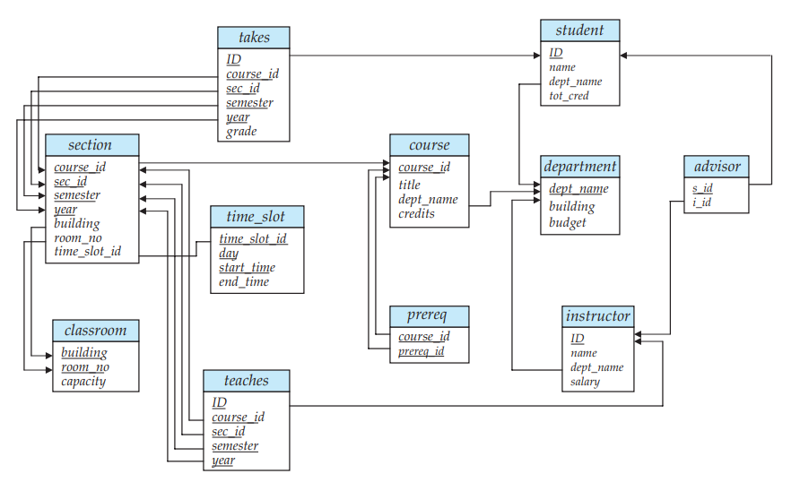

# 数据库系统-关系型数据库


// intro

本篇将介绍关系型数据库，数据库查询语言（SQL 语言）和形式关系查询语言。你将了解关系性数据库的详细内容，SQL 语句的使用，以及形式关系查询语言的用法。


## 介绍关系型模型

关系型模型是如今商业数据处理应用程序的主要数据模型。关系型模型因其简单易用的特点被广泛使用。

### 关系型数据库的结构

关系型数据库是一组**表**（Table）组成，每一个表分配一个唯一的名称。

关系型模型中，术语**关系**（Relation）用于参考数据库的表，术语**元组**（Tuple）用于参考数据库的行，术语**属性**（Attribute）参考数据库的列。术语**关系实例**（Relation Instance）参考数据的实例。一个关系由多个元组构成。一个元组由多个属性值构成。每一个属性的取值范围称为**域**（Domain）。所有的属性的域是原子的、不可分的。null 值是一个特殊的值，它表示未知或者不存在。

### 数据库模式

数据库的表现形式可以分为逻辑的和物理的。**数据库模式**（Database Schema）是数据库的逻辑设计。**数据库实例**（Database Instance）表示数据库某个时刻的数据的快照。数据库模式由一组属性和对应的域组成。

### 键

我们必须有一种方法去区分一个关系中的不同的元组。**Superkey** 是一个或多个属性组合，它可以唯一的标识关系中的一个元组。如，在关系型数据库中我们常用 ID 来标识一个行记录。没有子集 Superkey 的 Superkey ，这种最小的 Superkey 称为 **候选键**（Candidate Key）。在数据库中我们使用术语**主键**（Primary Key）来表示数据库设计人员选择的候选键。在一个关系中的任何两个元组不允许出现相同的 key 属性值。

一个关系 r1 的属性是另一个关系 r2 的主键，这个属性称为**外键**（Foreign Key）。**参考完整性约束**（Referential Integrity Constraint）表示一个外键属性值出现在参考关系中，它也必须出现在被参考的关系中。

### 模式图

数据库的主键和外键依赖可以通过**模式图**（Schema Diagram）来表示。每个关系用一个矩形表示，主键属性添加下划线，外键依赖表示为从外键属性出发的带箭头的线指向被参考的关系的主键属性。一个数据库模式图的例子，如下图所示。



### 数据库查询语言

数据库查询语言包括过程和非过程的。

**非过程查询语言**（Nonprocedural Language）是指用户描述希望得到的信息，没有给出一个获得信息的具体的过程。常见的非过程查询语言，如 **SQL** （Structured Query Language），**关系演算**（relational calculus）。

**过程查询语言**（Procedural Language）是指用户指定了执行一系列的操作计算得到希望的结果。常见的过程查询语言，如**关系代数**（relational algebra）。

本篇接下来会详细的介绍以上数据库查询语言的用户。

### 关系型操作

过程关系型查询语言提供了一组操作应用在一个关系或者多个关系中。关系查询的结果本身是一个关系，因此关系运算可以应用于查询结果以及给定的一组关系。具体的关系型操作的表达取决于具体的查询语言。

常见的操作有，选择满足条件的元组，选择某些属性，连接（join），笛卡尔积（Cartesian Product），组合（Union），相交（Intersect）等等。这些操作会在下面的关系代数查询语言中详细介绍。


## 介绍 SQL

有大量的数据库查询语言可以使用。SQL 是目前最广泛使用的一种查询语言。SQL 不仅能查询数据库，它也可以定义和修改数据库。

### SQL 语言概述

IBM 开发了初始版本的 SQL，原名为 Sequel。Sequel 语言经过发展，它的名称变成了 SQL （Structured Query Language）。1986年 国际标准组织（ISO）发布了一个 SQL 标准，称为 SQL-86。后续陆续发布了很多个 SQL  标准版本，最近的一个版本为 SQL:2008。

SQL 语言有多个部分：

- 数据定义语言（Data-Definition Language, DDL）,它可以定义、删除和修改关系模式（relation schema）。
- 数据操纵语言（Data-Manipulation Language, DML）它可以查询，插入，删除和修改数据库的元组。
- 完整性（Integrity）。DDL 包含语句可以指定数据的完整性约束。
- 视图定义。DDL 包含语句可以定义视图。
- 事务控制。SQL 包含命令可以指定事务的开始和结束。
- 嵌入的 SQL 或动态的 SQL。它可以嵌入在编程语言中如 C, C++, Java 进行操作数据库。
- 授权（Authorization）。DDL 包含语句可以指定关系和视图的访问权限。

每个数据库系统实现的 SQL 与标准的 SQL 有一些小差异，但大部分是标准的，SQL 的功能组成也大致一样。特定的数据库系统中的不标准的 SQL 可以查阅数据库系统的用户手册的解释。

### SQL 数据定义

数据库中的一组关系必须通过数据定义语言（DDL）来指定给数据库系统。SQL DDL 可以定义：

- 每个关系的模式（Schema）
- 每个属性的类型。
- 完整性约束。
- 每个关系的一组索引。
- 每个关系的安全和授权信息。
- 每个关系的物理存储结构。

#### 基本类型

SQL 标准支持大量的内置类型，包括：

- char(n)：固定长度 n 的字符串。
- varchar(n)：可变长度的字符串，最大长度为n。
- int：一个整数。与硬件相关的整数的有限子集。
- smallint：一个小的整数。
- numeric：指定精度和固定的小数部分的数。该数据有p位数字（加一个符号）组成，p 位数字中的 d 位在小数据的右边。如，numeric(3, 1) 可以表示 44.5，不可以表示 444.5，4.45 等。
- real, double precision：浮点数和双精度浮点数。具体精度与硬件相关。
- float(n)：一个浮点数，精度至少为 n 为。

每一种类型可以包含一个特殊的值称为 null。null 表示未知或者不存在。

char 数据类型存储固定长度的字符串，当字符串长度不够时，自动在字符串后面加空格。

char 和 varchar 等类型的字符串之间比较时，先转换为相同的长度，再进行比较。

SQL 也支持 **nvarchar** 类型，它是字符串类型，它存储的是 Unicode 编码或者多语言数据。而 varchar存储的是 ASCII 数据。nvarchar 一个字符使用 2 个字节，varchar 一个字符使用 1 个字节。然而，很多数据库允许 Unicode （UTF-8）的数据存储在 varchar 类型中。

#### 基本的模式定义

SQL 使用 create table 语句创建一个数据库的关系。如

```
create table department
	(dept_name varchar(20),
	building varchar(15) not null,
	budget numeric(12,2),
	primary key (dept_name));
```

SQL 可以指定完整性约束：

- primary key(Aj1, Aj2...)
- foreign key(Ak1, Ak2...)
- not null

插入元组语句：

```
insert into instructor
	values (10211, ’Smith’, ’Biology’, 66000);
```

删除元组语句：

```
delete from student;
```

删除表语句：

```
drop table r;
```

修改表语句。如，添加属性和删除属性。

```
alter table r add A D;
alter table r drop A;
```

### SQL 查询操作

基本的 SQL 查询语句有三个子句（Clause）：select，from 和 where。


## 中级的 SQL


## 高级的 SQL


## 形式关系查询语言（Formal Relational Query Language）


//ending