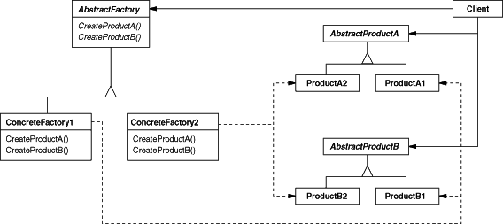

Title：设计模式（一）：创建型模式

创建型模式

- 什么是xxx模式
- 为什么需要xxx模式（它的优缺点、使用场景）
- xxx模式的实现（结构图、Java 实现代码）


```
//mode1
What
Context
Solution
Consequences

//mode2
What is it?
Problem of inflexible design and Context
Solution (relationships, responsibilities, collaborations, code)
Consequences (trade-off, costs and benefits.)

// mode3
What
Why
Solution
Consequences
```


---


本篇介绍设计模式的第一部分的5种创建型模式。本篇中的设计模式的实现代码使用 Java 语言描述。

## Creational Design Patterns

创建型设计模式抽象化实例过程。它们帮助使系统独立于对象是如何创建、组合和表示的。

它们封装系统使用的具体的 classes 的细节。隐藏 classes 的 objecdts 是如何创建的和放在一起的。系统最多知道对象的接口或抽象类是什么。创建型模式给你很大的灵活性在“创建什么”，“谁创建的”，“怎样创建的”和“什么时候创建的”等方面。

## Abstract Factory

### What

Abstract Factory 模式提供了一个接口来创建相关的对象家族，不用指定它们具体的 classes。

### Why

Motivation

我们想要整体的改变多个 objects，从一种类型的 objects 改变为另一种类型。

例子：一个应用可以切换不同的外观，主要是切换 widgets 的样式，widgets 包括：scroll bars，windows，和 buttons。不同的风格需要创建不同的 objects，我们希望风格切换后，可以轻易地创建不同风格的 widgets 对象。

Applicability

- 一个系统它的产品是如何 created，composed，和 represented 应该是独立的。
- 一个系统应该是配置多个产品家族中的一个。
- 相关的家族产品对象是设计成一起使用。
- 你想要提供一个产品的类库，只暴露它们的接口，不暴露它们的实现。

### Solution

Structure



Participants

- AbstactFactory。提供去创建抽象产品对象的接口。
- ConcreteFactory。实现创建具体产品对象的操作。
- AbstractProduct。定义一类产品对象的接口。
- ConcreteProduct。具体的产品对象。
- Client。仅仅使用 AbstractFactory 和 AbstractProduct classes。

Collaborations

在运行时，正常只有单个 ConcreteFactory class 实例是创建的。这个 concrete factory 创建产品对象有特定的实现。创建不同的产品对象，client 应该使用不同的 concrete factory。

AbstractFactory 将产品对象的创建推迟到它的 subclass ConcreteFactory.

Implementations

<details>
  <summary>Click to expand!</summary>

```java
interface AbstractFactory{
    abstract ProductA createProductA();
    abstract ProductB createProductB();
}                                                                              
	
class ConcreteFactory1 implements AbstractFactory{
    public ProductA createProductA(){
        return new ProductA1();
    }
    public ProductB createProductB(){
        return new ProductB1();
    }
}

class ConocreteFactory2 implements AbstractFactory{
    public ProductA createProductA(){
        return new ProductA2();
    }
    public ProductB createProductB(){
        return new ProductB2();
    }
}
	
interface ProductA{}
class ProductA1 implements AbstractProductA{}
class ProductA2 implements AbstractProductA{}
	
interface ProductB{}
class ProductB1 implements AbstractProductB{}
class ProductB2 implements AbstractProductB{}

public class FactoryProvider{
	public static AbstractFactory getFactory(String choice){
        return "1".equals(choice) ? new ConcreteFactory1() : new ConcreteFactory2();
    }
}

public class Client{
    public static void main(String[] args){
        AbstrsctFactory factory = FactoryProvider.getFactory("1");
        ProductA productA = factory.createProductA();
        ProductB productB = factory.createProductB();
    }
}
```
</details>

### Consequences

Benefits

- 它隔离具体的 classes。
- 它使得改变产品家族变得容易。
- 它提升了产品对象的一致性。

Drawbacks

- 支持新种类的产品是困难的。他需要修改 AbstractFactory 接口和它的子类。

## Builder

### What

将复杂对象的构造与其表现分开，因此相同的构造过程可以创建不同的表现。

### Why

Motivation


Applicability

### Solution

Structure

Participants

Collaborations

Implementations

### Consequences

Benefits

Drawbacks

## Factory Method

What

Why

Solution

Consequences

## Prototype

What

Why

Solution

Consequences

## Singleton

What

Why

Solution

Consequences

## References

[1] Design Patterns: Elements of Reusable Object-Oriented Software by Erich Gamma, Richard Helm, Ralph Johnson and John Vlissides