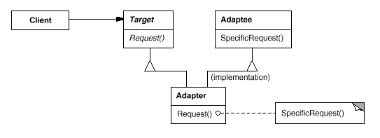
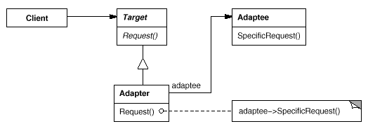
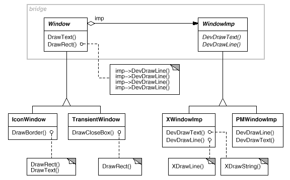
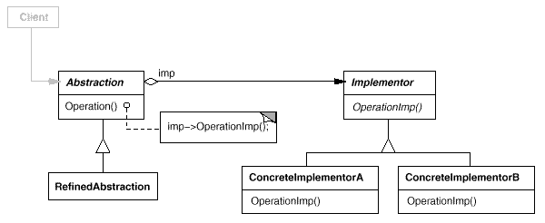
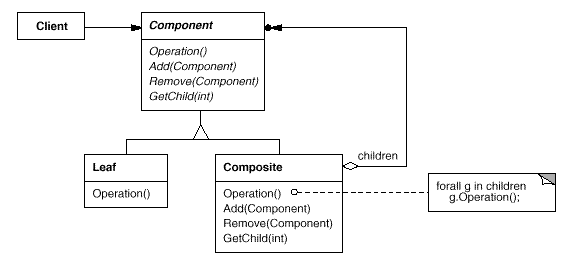
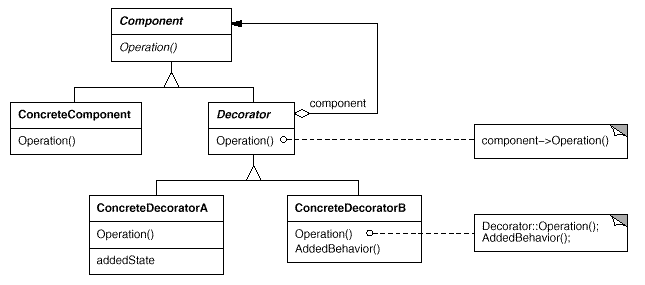
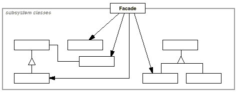
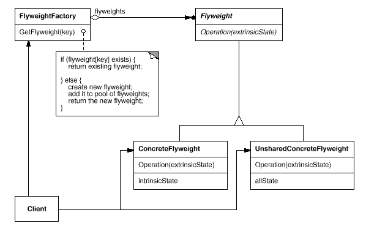

Title：设计模式（三）：结构型模式


本篇将介绍设计模式中的7种结构型模式，其中设计模式的实现代码使用 Java 语言描述。

## Structural Design Patterns

结构型设计模式关注 classes 和 objects 如何组成更大的结构。

## Adapter

### What

Adapter 将类的接口转换为 Client 期望的另一个接口。Adapter 让不兼容的 classes 一起工作。Adapter 让 Adaptee 适应 Target。

### Why

Motivation

一个不能兼容一个接口的，希望他能够兼容。

例子：画图编辑器可以让用户画和布置图形元素，如 lines，polygons，text 等。定义了一个抽象的图形化接口为 Shape。为每种图形对象定义子类，LineShape 对应 lines，PolygonShape 对应 polygons。基本的集合图形是比较容易实现的，但是文本的编辑更难实现。TextView 存在额外的方法，不能兼容 Shape 接口。我们可以使用 Adapter 模式让其兼容。我们可以定义 TextShape 它使得 TextView 接口适应 Shape 接口，其中 TextShape 为 Adapter，TextView 为 Adaptee。有两种实现方式，一种是继承另一种是组合。（1）TextShape 实现 Shape 接口和继承 TextView 的实现。（2）TextShape 实现 Shape 接口和组合一个 TextView 实例。

Applicability

- 你想要用一个已存在的 class，它的接口不匹配你的需求。
- 你想要创建一个重用的 class ，于不相关或无法预见的 classes 合作，即不一定具有兼容的接口。
- 你需要使用一些存在的子类，但是它是不能兼容每一个子类的接口。

### Solution

Structure





Participants

- Target：定义 Client 使用的特定领域的接口。
- Client：与符合 Target 接口的对象协作。
- Adaptee：定义一个需要适应的已存在的接口。
- Adapter：使 Adaptee 接口适应 Target 接口。

Collaborations

- clients 请求 Adapter 实例的方法。Adapter 通过请求 Adaptee 的方法得到结果。 

Implementations

方法一：Object Adapter。Adapter 组合 Adaptee 实例和实现 Target

<details>
  <summary>Click to expand!</summary>

```java
public interface Target{
    public void requestA();
}

public class TargetImpl{
    public void requestA(){
        System.out.println("requestA");
    }
}

public interface Adaptee{
    public void requestB();
}

public class AdapteeImpl implements Adaptee{
    public void requestB(){
        System.out.println("requestB");
    }
}

public class Adapter implements Target{
    private Adaptee adaptee;
    public Adapter(Adaptee adaptee){
        this.adaptee = adaptee;
    }
    public void requestA(){
        System.out.println("Adapter requestA");
    }
    public void requestB(){
        adaptee.requestB();
    }
}

public class Client{
    public static void main(String[] args){
        Adapter adapter = new Adapter(new AdapteeImpl());
        adapter.requestA();
        adapter.requestB();
    }
}
```
</details>

方法二：Class Adapter。Adapter 继承 AdapteeImpl 和实现 Target

<details>
  <summary>Click to expand!</summary>

```java
public interface Target{
    public void requestA();
}

public class TargetImpl{
    public void requestA(){
        System.out.println("requestA");
    }
}

public interface Adaptee{
    public void requestB();
}
public class AdapteeImpl implements Adaptee{
    public void requestB(){
        System.out.println("requestB");
    }
}
public class Adapter extends AdapteeImpl implements Target{
	public void requestA(){
        System.out.println("Adapter requestA");
    }
}

public class Client{
    public static void main(String[] args){
        Adapter adapter = new Adapter();
        adapter.requestA();
        adapter.requestB();
    }
}
```
</details>

### Consequences

Class Adapter (Inheritance)

- 只能让 Adaptee 的具体子类适应 Target。因此，它不能使一个 class 和它的子类都适应 Target。
- 可以让 Adapter 从写 Adaptee 的一些行为。
- 仅仅引入一个对象，并且不需要其他指针间接访问 adaptee。

Object Adapter (Composition)

- 让单个 Adapter 与Adaptee 和它的所有子类都适应 Target。Adapter 可以同时为所有 Adaptee 增加功能。
- 很难 override Adaptee 的行为。他需要参考 Adaptee 的子类，而不是自己作为它的子类。

## Bridge

### What

解耦抽象与它的实现，因此它们可以独立地改变。抽象类和实现类没有通过 implement 关键字进行绑定，而是通过构造方法注入的方式，将实现类注入到抽象类中。

### Why

Motivation

一个抽象有很多种可能的实现，通常使用 inheritance 来实现。定义一个 interface 去抽象，和具体的 subclasses 不同的方式去实现。但是这种方式不总是足够的灵活。inheritance 将 implementation 永久地绑定了 abstraction，这使得很难独立地去修改、扩展，以及重用抽象和实现。

例子：Window abstraction 需要在两个平台（X Window System and IBM's Presentation Manager）实现，定义一个抽象类 Window 和定义两个子类 XWindow 和 PMWindow 实现 Window。这个方法有两个缺点：1. 它不方便去扩展 Window 抽象在不同种类的 windows 或新的平台。支持新的 IconWindow 需要实现两个新的类 XIconWindow 和 PMIconWindow。支持新的平台需要每种 window 都需要新的 Window 子类。2. 它使得 client 代码是平台依赖的。

Client 应该能够创建 window 对象时不需要指定具体的实现。仅仅只有 window implementation 应该是依赖平台的，Windows 对象不需要指定平台。



Applicability

- 你想避免永久地绑定抽象和它的实现。
- 抽象和它的实现都应该通过子类扩展。
- 改变一个抽象的实现应该不会对 Client 有影响。
- 你想要完全地隐藏一个抽象的实现。
- 你的 classes 种类非常多。class 层级结构表明 classes 需要分离到两个部分。
- 你想多个 objects 共享一个实现，并且这个事实应该对 client 隐藏。

### Solution

Structure



Participants

- Abstraction：定义 abstraction 的接口。维护一个对 Implementor 的对象的参考。
- RefinedAbstraction：扩展 Abstraction 接口。
- Implementor：定义 implementation 的接口。
- ConcreteImplementor：实现 implementor 接口。

Collaborations

- Abstraction 转发 client 请求到它的 implementor 对象。

Implementations

<details>
  <summary>Click to expand!</summary>

```java
abstract interface Abstraction{
    protected Implementor implementor;
    protected Abstraction(Implementor implementor){
        this.implementor = implementor;
    }
    abstract public void operation();
}

public class AbstractionImpl{
    public AbstractionImpl(Implementor implementor){
        super(implementor);
    }
    public void operation(){
        implementor.operationImpl();
    }
}

public interface Implementor{
    void operationImpl();
}

public class ImplementorImpl1{
    public void operationImpl(){
        System.out.println("operation implements by ImplementorImpl1...");
    }
}
public class ImplementorImpl2{
    public void operationImpl(){
        System.out.println("operation implements by ImplementorImpl2...");
    }
}

public class Client{
    public static void main(String[] args){
        Abstraction abstraction = new AbstractionImpl(new ImplementorImpl2());
        abstraction.operation();
    }
}
```
</details>

### Consequences

Benefits

- 解耦 interface 和 implementation。
- 提升扩展性。你可以独立地扩展 Abstraction 和 Implementor 层级结构。
- 对 client 隐藏 implementation 的实现。

## Composite

### What

将对象组成树形结构以表示部分整体层次结构。Composite 让 client 统一地对待单一对象和组合对象。

### Why

Motivation

可以将多个 components 组成更大的 components，每个节点可以是单个组件，也可以是多个组件的组合，每个节点用统一的接口对象表示。

例子：如画图编辑器，可以画线、多边形和文字，也可以是图文的方式。图文这种元素是多种组件的结合，我们想把组合元素和单一元素一样对待，减少代码的复杂，可以使用 Composite 模式来实现。

Applicability

- 你想表示对象的部分整体层次结构。
- 你想让 Client 忽略组合对象和单一对象的不同。Client 统一地对待所有在 Composite 接口中的 Object。

### Solution

Structure



Participants

- Component：为 Composite 对象定义一个接口。为访问和管理子节点声明接口。
- Composite：为有 Children 的组件定义行为。存储子组件。实现 child-related 操作。
- Client：通过 Component 接口库操作 Composite 中的对象。

Collaborations

- Client 使用 Component class interface 去与 Composite 结构中的 Objects 进行交互。

Implementations

<details>
  <summary>Click to expand!</summary>

```java
public interface Component{
    void operation();
    void add(Component component);
    void remove(Component component);
    Component getChildren(int index);
}

public class Composite implements Component{
    private String name;
    public Composite(String name){
        this.name = name;
    }
    private List<Composite> compositeList;
    public void operation(){
        System.out.println("I am " + name);
        if (compositeList != null){
            for (Composite composite : compositeList){
                composite.operation();
            }
        }
    }
    public void add(Composite composite){
        if (compositeList == null){
            compositeList = new ArrayList<Composite>();
        }
        compositeList.add(Composite)
    }
    public void remove(Composite composite){...}
    public Composite getChild(int index){
        if (index >= 0 && && composite != null && index < compositeList.size()){
            return compositeList.get(index);
        }
        return null;
    }
}

public class Main{
    public static void main(String[] args){
        Component parent = new Composite("parent");
        Component child = new Composite("child");
        parent.add(child);
        parent.operation();
        child.operation();
    }
}
```
</details>

### Consequences

Benefits

- 定义由 primitive objects 和 composite objects 组成的 class 层级结构。Primitive objects 可以被组合为更复杂的 objects。
- 它使得 client 简单。 Client 统一地对待 composite structures 和 individual objects。
- 更容易添加新类型的 components。

Drawbacks

- 它使你的设计过于笼统。很难去限制 composite component。你需要自己在运行时检查对 composite component 的约束，如限制一个组合组件的子组件的个数。

## Decorator

### What

动态地给一个 object 附加额外的职责。Decorator 为子类提供了灵活的替代方案，以扩展功能。

### Why

Motivation

有时我们想为 objects 添加职责，而不是整个 class。如，为文本阅读器添加 border 或者 scroll 等。

一种实现方式是通过 inheritance 来添加职责，这种方式是不灵活的，它是静态的，它为每一个实例都添加了这个职责，而且每次添加额外的职责都需要修改 class。另一种更灵活的方法是使用 Decorator 设计模式。它让你循环嵌套 decotrators，允许无限的添加职责。

Applicability

- 动态地、透明地为单个 object 添加职责，没有影响其他的 objects。
- 职责是可以被撤回的。
- 当通过子类扩展是不可行时。

### Solution

Structure



Participants

- Component：定义组件接口。
- ConcreteComponent：实现组件的 class。
- Decorator：为 Component 对象维护一个引用。定义一个符合 Component 接口的接口。
- ConcreteDecorator：为 component 对象添加职责的 class。

Collaborations

- Decorator 转发请求给它的 Component 对象。它可能选择性地在请求之前和之后执行额外的操作。

Implementations

<details>
  <summary>Click to expand!</summary>

```java
public interface Component{
    pubilc String operation();
}

public class ConcreteComponet{
    public String operation(){
        return "concreteComponent operation..."
    }
}

public interface Decorator extends Component{}

public class ConcreteDecorator{
    private Component component;
    public ConcreteDecorator(Component component){
        this.component = component;
    }
    public String operation(){
        return this.component.operation() + "ConcreteDecorator1 operation..."
    }
}

public class Client{
    public static void main(String[] args){
        Component component = new ConcreteComponent();
        component = new ConcreteDecorator(component);
        System.out.println(component.operation());
    }
}
```
</details>

### Consequences

Benefits

- Decorator 比静态 inheritance 更灵活。
- 避免功能丰富的 classes 增加层级结构。

Drawbacks

- decorator 和它的 component 不是同一个 object。当你使用 decorator 时，你不应该依赖一个对象。
- 存在大量很小的 objects。

## Facade

### What

为一个子subsystem 中的一组接口提供一个统一的接口。Facade 定义了一个更高层级的接口，它使得 subsystem 更容易使用。

### Why

Motivation

-  将系统构建为子系统有助于降低复杂性。一个普遍的设计目标时最小化系统之间的交流和依赖。一种实现这个目标的方式是使用 Facade 模式。

Applicability

- 你想为复杂的子系统提供一个简单的接口。
- 在 Client 和抽象类的实现之间有很多依赖。使用 Facade 去解耦子系统与 client 和其他子系统，从而提升子系统的独立性和移植性。
- 你想将你的子系统分层。使用 Facade 为每个子系统定义一个接入点。

### Solution

Structure



Participants

- Facade：知道 subsystem 中的哪个 class 能处理哪个 request。将 client 的 request 委托给合适的 subsystem 的 objects。
- subsystem classes：subsystem 的 classes。

Collaborations

Implementations

<details>
  <summary>Click to expand!</summary>

```java
public interface SubSystemInterface{
    public String handleRequest();
}
public class SubSystemClass1 implements SubSystemInterface{
    public String handleRequest(){
        return "SubSystemClass1 return result...";
    }
}
public class SubSystemClass2 implements SubSystemInterface{
    public String handleRequest(){
        return "SubSystemClass2 return result...";
    }
}

public class Facade{
    public String handleRequest1(){
        return new SubSystemClass1().handleRequest();
    }
    public String handleRequest2(){
        return new SubSystemClass2().handleRequest();
    }
}

public class Client{
    public static void main(String[] args){
        Facade facade = new Facade();
        String result1 = facade.handleRequest1();
        String result2 = facade.handleRequest2();
    }
}
```
</details>

### Consequences

Benefits

- 它对 client 隐蔽子系统的 components，减少 client 需要处理的 objects 的数量，以及使得 subsystem 更容易使用。
- 它减少了 subsystem 和 clients 之间的耦合。
- 它没有阻止应用程序在需要时使用子系统的 classes。因此你可以在易用性和通用性之间进行选择。

## Flyweight

### What

### Why

Motivation

Applicability

### Solution

Structure



Participants

- Flyweight：
- ConcreteFlyweight：
- UnsharedConcreteFlyweight：
- FlyweightFactory：
- Client：

Collaborations

Implementations

<details>
  <summary>Click to expand!</summary>

```java
todo
```
</details>

### Consequences


## Proxy

### What

### Why

Motivation

Applicability

### Solution

Structure


Participants


Collaborations

Implementations

<details>
  <summary>Click to expand!</summary>

```java
todo
```
</details>

### Consequences

Benefits

Drawbacks

## References

[1] Design Patterns: Elements of Reusable Object-Oriented Software by Erich Gamma, Richard Helm, Ralph Johnson and John Vlissides

