Title：设计模式（三）：行为型模式

## Chain of Responsibility
### What

通过给多个对象处理请求的机会，避免耦合请求发送者与接收者。Chain 接收请求，并沿着 chain 传递请求直到有一个对象能够处理该请求为止。

### Why

Motivation

避免将请求者与具体的接收者绑定。使用一个类统一接收所有请求，接收者连接成一条链来处理请求。

Applicability

- 超过一个对象去处理请求。
- 你想发送一个请求给一些对象中的一个，并且不明确指定接收者。
- 动态指定一组对象能处理一个请求。

### Solution

Structure

类结构

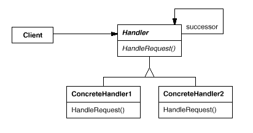

对象结构

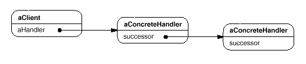

Participants

- Handler：定义一个接口去处理请求。
- ConcreteHandler：处理请求。接收继任者（successor）。如果它能处理一个请求，则处理它；如果不能，则转发这个请求给它的继任者。
- Client：初始化一个请求给 chain 上的一个 ConcreteHandler 对象。

Collaborations

- 当 Client 发送一个请求，这个请求在 Chain 上传播，直到有一个 ConcreteHandler 对象能够处理它。

Implementations

<details>
  <summary>Click to expand!</summary>

```java
public abstract class Handler{
    private Handler nextHandler;
    
    public abstract void handleRequest();
    
    public void setNext(Handler handler){
        this.nextHandler = handler;
    }
}

public class ConcreteHandler1 extends Handler{
    public void handleRequest(int request){
        if (request == 1){
            System.out.println("handle by ConcreteHandler1");
        }else{
            if (nextHandler != null)
                nextHandler.process(request);
        }
    }
}

public class ConcreteHandler2 extends Handler{
    public void handleRequest(int request){
        if (request == 2){
            System.out.println("handle by ConcreteHandler2");
        }else{
            if (nextHandler != null)
                nextHandler.process(request);
        }
    }
}

public class Client{
    public static void main(String[] args){
        Handler handler = new ConcreteHandler1();
        Handler nextHandler = new ConcreteHandler2();
        handler.setNext(nextHandler);
        handler.handleRequest(1);
        handler.handleRequest(2);
    }
}
```
</details>

### Consequences

Benefits

- 减少了耦合。
- 增加了分配职责给对象的灵活性。

Drawbacks

- 接收不能保证。因为一个请求没有明确指定接收者，所有不能保证它能被处理。

## Command

### What

封装一个请求作为一个对象，因此让你参数化客户端的不同请求。

### Why

Motivation

有时需要发送一个请求给对象，但不知道任何关于请求的操作或者请求的接收者。

Applicability

- 参数化执行动作作为对象。
- 在不同的时间指定，排队和执行请求。Command 对象的生命周期可以独立于原始请求。
- 支持 undo。Command 执行操作可以存储状态用来反转影响 command 本身。
- 支持 logging changes。所以可以在系统崩溃后可以重新正确运行。
- 围绕基于 primitive 操作的 high-level 操作来构建系统。

### Solution

Structure

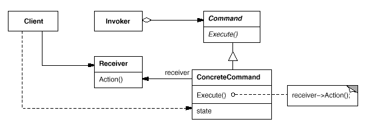

Participants

- Command：为执行一个操作声明一个接口。
- ConcreteCommand：定义一个在 Receiver object 和 action 的绑定。通过调用接收者相应的操作来实现 Execute。 
- Cient：创建一个 ConcreteCommnd object，以及设置它的 receiver。
- Invoker：请求 command 得到请求结果。
- Receiver：知道如何执行与请求相关的操作。

Collaborations

- Client 创建一个 ConcreteCommand 以及指定它的 receiver。
- Invoker 对象存储 ConcreteCommand 对象。
- Invoker 通过调用 command 对象的 execute() 方法就，发出请求。
- ConcreteCommand 对象调用接收者的操作得到请求结果。

Implementations

<details>
  <summary>Click to expand!</summary>

```java
public interface Command{
    void execute();
}
public class Receiver{
    public void action1(){
        System.out.println("action 1 executing...");
    }
    public void action2(){
        System.out.println("action 2 executing...");
    }
}
public class ConcreteCommand1 implements Command{
    public Receiver receiver;
    public ConcreteCommand1(Receiver receiver){
        this.receiver = receiver;
    }
    public void execute(){
        receiver.action1();
    }
}
public class ConcreteCommand2 implements Command{
    public Receiver receiver;
    public ConcreteCommand1(Receiver receiver){
        this.receiver = receiver;
    }
    public void execute(){
        receiver.action2();
    }
}
public class Invoker{
    Command slot;
    public void setCommand(Command command){
        this.slot = command;
    }
    public void requestExecute(){
        this.slot.execute();
    }
}
public class Clinet{
    Invoker invoker = new Invoker();
    Receiver receiver = new Receiver();
    invoker.setCommnad(new ConcreteComand1(receiver));
    invoker.requestExecute();
    invoker.setCommnad(new ConcreteComand2(receiver));
    invoker.requestExecute();
}
```
</details>

### Consequences

Benefits

- 请求命令是很灵活的。
- 支持 undo 和 redo。Command 可以提供一个方式去反转它的执行。
- 避免在 undo 过程中错误积累。

Drawbacks


## Interpreter

### What

给定一种语言，定义其语法表示形式，以及使用该表示形式来解释语言中的句子。

### Why

Motivation

如果一个种特殊的问题经常发生，它可能值得用简单的语言将问题的实例表达为句子。然后，你可以构建 interpreter 通过解释这些句子来解决问题。

Applicability

- 语法是简单的。
- 效率不是一个关键问题。

### Solution

Structure


Participants

- AbstractExpression：定义一个抽象 interpret 操作，它存在于所有 abstract syntax tree 中的节点。
- TerminalExpression：实现与 terminal symbols 有关的 interpret 操作。
- NonterminalExpression：实现 nonterminal symbols 相关的 interpret 操作。
- Context：包含给 interpreter 的全部信息。
- Client：构建一个抽象的 syntax tree 表示一个符合语法规定的特定的句子。调用 interpret 操作。

Collaborations

- Client 构建一个句子作为 NonterminalExpression 和 TerminalExpression 实例的abstract syntax tree 。然后，client 初始化 context，调用 interpret 操作。
- 每个 NonterminalExpression node 定义了 interpret 对每个子表达式上的 interpret。
- 每个 node 的 interpret 操作使用 context 去存储和访问 interpreter 的 state。

Implementations

<details>
  <summary>Click to expand!</summary>

```java
public interface Expression{
    boolean interpret(String context);
}

public class TerminalExpression implements AbstractExpression{
    private String data;
    public TerminalExpression(String data){
        this.data = data;
    }
    public boolean interpret(Context context){
        if (data.contains(Context.data)){
            return true;
        }else{
            return false;
        }
    }
}
public class NonTerminalExpression implements AbstractExpression{
    private Expression expression1;
    private Expression expression2;
    public NonTerminalExpression(Expression expression1, Expression expression2){
        this.expression1 = expression1;
        this.expression2 = expression2;
    }
    public boolean interpret(Context context){
        return expression1.interpret(context) && expression2.interpret(context);
    }
}
public class Context{
    private String data;
    public Context(String data){
        this.data = data;
    }
}

public class Client{
    Context context1 = new Context("Tom");
    TerminalExpression terminalExp1 = new TerminalExpression("Tom");
    TerminalExpression terminalExp2 = new TerminalExpression("Jack");
    terminalExp1.interpret(context1);
    terminalExp2.interpret(context1);
    NonTerminalExpression nonTerminalExp = new NonTerminalExpression(terminalExp1, terminalExp2);
    nonTerminalExp.interpret(context1);
}
```
</details>

### Consequences

Benefits

- 它很容易去改变和扩展语法。
- 实现语法是容易的。
- 可以增加新的方式去 interpret 表达式。

Drawbacks

- 复杂的语法很难去管理和维护。


## Iterator

### What

提供以一种方式去顺序地访问聚合对象地元素，而不暴露它的底层表示。

### Why

Motivation

一个聚合对象如 list，应该有一种方式去访问它的元素而不暴露它的内部结构。你可能想要用不用地方式去遍历集合，取决于你想要的实现。Iterator 模式可以帮你完成以上功能。

Applicability

- 访问一个聚合对象的内容，而不暴露它的内部表示。
- 支持多种对聚合对象的遍历方式。
- 提供统一的接口去遍历不同的聚合数据结构。

### Solution

Structure

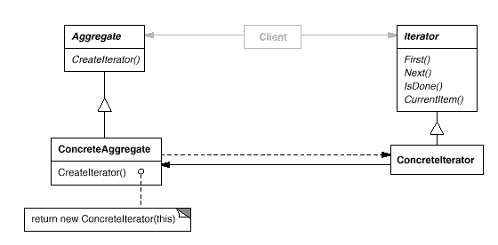

Participants

- Iterator：定义一个接口去访问和遍历元素。
- ConcreteIterator：实现 Iterator 接口。保持追踪遍历聚合元素的位置。
- Aggregate：定义创建 Iterator 对象的接口。
- ConcreteAggregate：实现创建 Iterator 对象接口，返回合适的 ConcreteIterator 对象。

Collaborations

- ConcreteIterator 保持聚合元素对象的轨迹，能够计算在遍历中接下的元素对象。

Implementations

<details>
  <summary>Click to expand!</summary>

```java
public interface Aggregate{
    Iterator createIterator();
}
public class ConcreteAggregate implements Aggregate{
    private int[] data = new int[32];
    private int size;
    private int currentSize;
    
    public void add(int number){
        data[currentSize] = number;
        currentSize++;
    }
    
    public Iterator createIterator(){
        return new ConcreteIterator(data, currentSize);
    }
}

public interface Iterator{
    int first();
    void next();
    boolean isDone();
    int currentItem();
}
public class ConcreteIterator implements Iterator{
    private int[] data;
    private int cursor = 0;
    
    public ConcreteIterator(int[] data, int currentSize){
        data = new int[currentSize];
        for (int i = 0; i < currentSize; i++){
            this.data[i] = data[i];
        }
    }
    
    public int first(){
        // TODO
        return null;
    }
    public int next(){
        if (cursor < data.length){
            return data[cursor++];
        }else{
            throw new ArrayIndexOutOfBoundExcpetion();
        }
    }
    public boolean isDone(){
        return cursor >= data.length -1;
    }
    public int currentItem(){
        // TODO
        return null;
    }
}

public class Client{
    public static void main(String[] args){
        Aggregate aggregate = new ConcreteAggregate();
        aggregate.add(1);
        Iterator iterator = aggregate.createIterator();
        while(! iterator.isDone()){
            System.out.println(iterator.next());
        }
    }
}
```
</details>

### Consequences

Benefits

- 它支持聚合结构的遍历的变化。
- Iterator 简化了 Aggregate 接口。
- 多个 traversal 可以在聚合结构等待的。


## Mediator

### What

定义一个对象封装一组对象如何交互。Mediator 通过防止对象之间显式地互相引用来促进松耦合，并且它是你可以独立地更改它们之间的交互。

### Why

Motivation

面向对象的设计鼓励在对象之间分配行为。这种分配可能导致一个对象与很多对象有关联。大量的相互连接让系统的行为很难去改变。你可以使用 Mediator 去解决这类问题。Mediator 可以用来控制和协调一组对象之间的交互。Mediator 从当了中介，可以防止一组对象明确地相互引用。对象只知道 Mediator，从而减少对象相互连接的数量。

Applicability

- 一组对象交流十分复杂。
- 重用一个对象是复杂的，因为它引用了很多其他的类，以及与很多其他类存在交流。
- 在多个类之间分布的行为应可自定义，而无需大量子类化。

### Solution

Structure

类结构

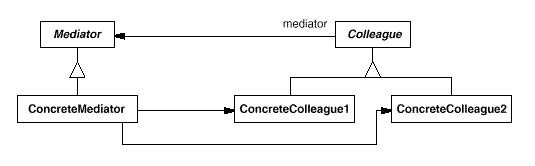

对象结构

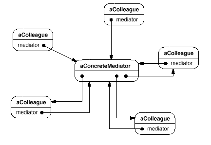

Participants

- Mediator：为 Colleague 对象交流定义一个接口。
- ConcreteMediator：通过协调 Colleague 对象来实现合作行为。知道和维护它的 colleagues 对象。
- Colleague classes：每一个 Collegue class 知道它的 Mediator 对象。每个  colleague 与它的 mediator 交流。

Collaborations

- Colleagues 发送和接收请求来自 Mediator 对象。Mediator 通过在适当的 Colleagues 之间路由请求来实现协作行为。

Implementations

<details>
  <summary>Click to expand!</summary>

```java
public interface Mediator{
    
}
public class ConcreteMediator implements Mediator{
    private ConcreteColleague1 concreteColleague1;
    private ConcreteColleague2 concreteColleague2;
    public void setConcreteColleague1(ConcreteColleague1 concreteColleague1){
        this.concreteColleague1 = concreteColleague1;
    }
    public void setConcreteColleague2(ConcreteColleague2 concreteColleague2){
        this.concreteColleague2 = concreteColleague2;
    }
    public void callHelloToColleague2FromColleague1(){
        concreteColleague2.hello(concreteColleague1);
    }
}
public interface Colleague{
    
}
public class ConcreteColleague1 implements Colleague{
    private Mediator mediator;
    public ConcreteColleague1(){}
    public ConcreteColleague1(Mediator mediator){
        this.mediator = mediator;
    }
    public void sayHelloToColleague2(){
        mediator.sayHelloToColleague2FromColleague1();
    }
}
public class ConcreteColleague2 implements Colleague{
    private Mediator mediator;
    public ConcreteColleague2(){}
    public ConcreteColleague2(Mediator mediator){
        this.mediator = mediator;
    }
    public void hello(Colleague colleague){
        System.out.println("hello, response to " + colleague);
    }
}
public class Client{
    public static void main(String[] args){
        // config mediator
        Mediator mediator = new ConcreteMediator();
        ConcreteColleague1 colleague1 = new ConcreteColleague1(mediator);
        ConcreteColleague2 colleague2 = new ConcreteColleague2(mediator);
        mediator.setConcreteColleague1(colleague1);
        mediator.setConcreteColleague2(colleague2);
        // send request among colleagues by call mediator methods
        colleague1.sayHelloToColleague2();
    }
}
```
</details>

### Consequences

Benefits

- 它限制了子类。
- 它解耦了 colleagues。
- 它简化对象协议。
- 它将对象的协作抽象化。
- 它中心控制对象的交互。

Drawbacks

- 由于它中心控制对象的交互，Mediator 会变得很庞大，它自身变得很难维护。

## Memento

### What

在不违反封装和外部化对象的内部状态等情况下，使得对象可以在以后恢复之前的状态。

### Why

Motivation

有时需要记录一个对象的内部状态。当实现检查点和 undo 功能让用户在发生错误时恢复状态记录对象状态是需要的。但是对象一般是封装了一些或全部状态，使它不能被其他对象访问，以及不可能在外部保存。暴露对象的内部状态违反了封装，这会损害应用程序的可靠性和可扩展性。

我们可以使用 Memento 模式解决这个问题。memento 是一个对象，它可以存储对象内部状态的快照（snapshot）。

Applicability

- 一个对象的状态的快照必须保存，因此它可以在以后恢复之前的状态。
- 一个接口直接地获取状态将暴露实现细节和打破对象的封装。

### Solution

Structure

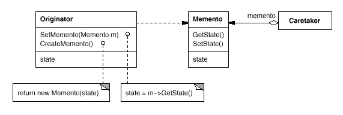

Participants

- Memento：1）存储 originator 对象的内部状态。2）防止非 originator 对象访问。3）它是一个 POJO 类。
- Originator：1）创建一个 包含当前内部状态快照的 memento。2）使用 memento 去恢复它的内部状态。
- Caretaker：1）负责 memento 的保管。2）不操作或检查 memento 的内容。3）保持多个 memento 的轨迹，维护保存点。

Collaborations

- caretaker 从 originator 请求一个 memento，保持一段时间，以及把它传回 originator。它们的交互如下图所示。

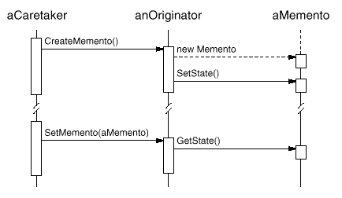

- Memento 是被动的。只有 orginator 能够创建 memento 指派或取回它的状态。

Implementations

<details>
  <summary>Click to expand!</summary>

```java
public class Memento{
    private int state;
    
    public Memento(）{}
    public Memento(int state){
        this.state = state;
    }
    public int getState(){
        return state;
    }
    public void setState(int state){
        this.state = state;
    }
}
public class Originator{
    private int state;
    public void setState(int state){
        this.state = state;
    }
    public int getState(){
        return this.state;
    }
    public void createMemento(){
        return new Memento(this.state);
    }
    public setMemento(Memento memento){
        this.state = memento.getState();
    }
}
pubilc class Caretaker{
    private List<Memento> mementos = new ArrayList<>();
    private Originatro orginator;
    public Caretacker(Originator orginator){
        this.originator = orginator;
    }
    pubilc void addMemento(){
        Memento newMemento = this.originator.createMemento();
        this.mementos.add(newMemento);
        return newMemento;
    }
    public void setMemento(Memento memento){
        for (m : mementos){
            if (m.state == memento.state){
                this.originator.setMementor(m);
            }
        }
    }
}

public class Client{
    public static void main(String[] args){
        Originatro originator = new Originator();
        Careracker caretacker = new Caretacker(originator);
        originator.setState(1);
        System.out.println("state one: " + originator.getState());
        Memento memento1 = caretacker.addMemento();
        originator.setState(2);
        System.out.println("state two: " + originator.getState());
        Memento memento2 = caretacker.addMemento();
        caretacker.setMemento(memento1);
        System.out.println("restore state one: " + originator.getState());
    }
}
```
</details>

### Consequences

Benefits

- 保持封装边界。
- 简化 originator。把 originator 内部状态的版本保留放到了其它类中。

Drawbacks

- 使用 memento 可能是昂贵的。如果 Originator 拷贝大量的信息存储在 memento，memento 可以导致很大的花费。
- 保管 mementos 的隐性成本。caretaker 负责删除它保管的 mementos。然而 caretaker 不知道在 memento 中有多少 state。因此，caretaker 可以能导致大量的存储 mementos 的花费。


## Observer
### What

在对象中定义一对多的依赖，因此当一个对象改变状态时，所有它的依赖者是自动通知和更新的。

### Why

Motivation

将系统划分为一组合作的 classes 常见的辅作用是需要维护相关对象之间的一致性。你不想通过使 classes 紧耦合来实现一致性，因为它减少了重用性。

Applicability

- 当一个抽象有两个方面，一个依赖另一个。在具体的对象中封装这些方面，让你独立地改变和重用它们。
- 当你改变一个对象需要改变其他对象，并且你不知道有多少对象需要改变时。
- 一个对象可以通知其他对象不需要关心这些对象是什么。

### Solution

Structure

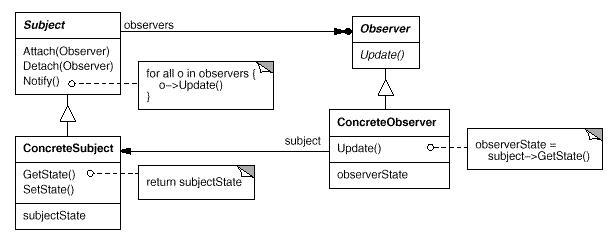

Participants

- Subject：1）知道它的 observers。无数个 Observer 对象可能观察 subject。2）提供一个接口关联和脱离 Observer 对象。
- Observer：为 subject 改变通知的对象定义一个更新的接口。
- ConcreteSubject：1）存储 ConcreteObserver 对象的信息。2）当状态改变时发送通知给它的 observers。
- ConcreteObserver：1）维护一个 ConcreteSubject 的引用。2）存储与 subject 一致的状态。3）实现 Observer 更新接口，保持它的状态与 subject 一致。

Collaborations

- 当改变发生时，ConcreteSubject 通知它的 observers，让 observers 的状态和自己的保持一致。
- 当改变通知之后， ConcreteObserver 对象可能查询 subject 的信息。ConcreteObserver 使用这个信息使它的状态与 subject 保持一致。

Implementations

<details>
  <summary>Click to expand!</summary>

```java
public interface Subject{
    void attach(Observer observer);
    void detach(Observer observer);
    void notify();
}
public class ConcreteSubject implements Subject{
    private int state;
    List<Observer> observers = new ArrayList<>();
    
    public void setState(int state){
        this.state = state;
        notify();
    }
    public int getState(){
        return this.state;
    }
    public void attach(Observer observer){
        observers.add(observer);
    }
    public void detach(Observer observer){
        observers.remove(observer);
    }
    public void notify(){
        for (Observer observer : observers){
            observer.update();
        }
    }
}
public interface Observer{
    void update();
}
public class ConcreteObserver1 implements Observer{
    private int state;
    private Subject subject;
    
    public ConcreteObserver1(){}
    public ConcreteObserver1(Subject subject){
        this.subject = subject;
        this.state = subject.getState();
    }
    public int getState(){
        return this.state;
    }
    public void update(){
        this.state = subject.getState();
    }
}
public class ConcreteObserver2 implements Observer{
    private int state;
    private Subject subject;
    
    public ConcreteObserver2(){}
    public ConcreteObserver2(Subject subject){
        this.subject = subject;
        this.state = subject.getState();
    }
    public int getState(){
        return this.state;
    }
    public void update(){
        this.state = subject.getState();
    }
}
public class Cilent{
    public static void main(String[] args){
        int state = 1;
        Subject subject = new ConcreteSubject(state);
        Observer observer1 = new ConcreteObserver1(subject);
        Observer observer2 = new ConcreteObserver2(subject);
        System.out.println("observer1 state is " +  observer1.getState());
        System.out.println("observer2 state is " +  observer2.getState());
        subject.attach(observer1);
        subject.attach(observer2);
        // automatically notify and update observers
        subject.setState(2);
        System.out.println("observer1 state update to " +  observer1.getState());
        System.out.println("observer2 state update to " +  observer2.getState());
    }
}
```
</details>

### Consequences

Benefits

- 抽象地耦合 Subject 和 Observer。subjecct 不知道它有一组 observers，不知道 observer 具体的类。
- 支持广播通信。

Drawbacks

- 意外的更新。可能会导致 observers 很难追踪的虚假更新。


## State
### What

当一个对象的内部状态改变时允许改变它的行为。这个对象好像更改了它的 classs。

### Why

Motivation

一个对象需要在不同的状态表现不同的行为。

例子：TCPConnection class 他表示一个网络连接。一个 TCPConnection object 可可能有不同的一个状态：Established，Listening，Closed。当一个 TCPConnection 对象接收到请求时，它根据当前的状态进行响应。

Applicability

- 一个对象的行为取决于它的状态，并且它必须根据它的状态在运行时改变它的行为。
- 操作有大量的多条件语句，这些语句取决于对象的状态。

### Solution

Structure

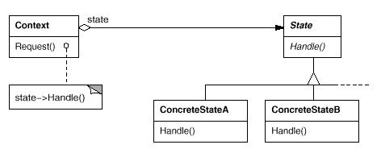

Participants

- Context：1）定义 Client 想要的接口。2）维护一个 ConcreteState 子类实例，它定义了当前状态。
- State：定义一个接口去封装与 Context 的特殊状态相关的行为。
- ConcreteState：每个子类实现与 Context 的状态相关的行为。

Collaborations 

- Context 将特定状态的请求委托给当前的 ConcreteState 对象。
- Context 可以将自身作为参数传递给处理请求的 State 对象。
- Context 是 Client 的主要接口。Client 可以通过 State 对象配置 context。一旦 Context 配置了，它的 client 不需要直接处理 State 对象。
- 无论是 Context 还是 ConcreteState 子类 都能决定哪个状态接替另一个和在什么情况下。

Implementations

<details>
  <summary>Click to expand!</summary>

```java
public class Context{
    private State state;
    public Context(){}
    public Context(State state){
        this.state = state;
    }
    public void setState(State state){
        this.state = state;
    }
    public void request(){
        this.state.handle()
    }
}

public interface State{
    void handle();
}
public class ConcreteStateA implements State{
    public void handle(){
        System.out.println("handle by ConcreteStateA");
    }
}
public class ConcreteStateB implements State{
    public void handle(){
        System.out.println("handle by ConcreteStateB");
    }
}

public class Client{
    public static void main(String[] args){
        State state = new ConcreteStateA();
        Context context = new Context(state);
        context.request();
        state = new ConcreteStateB();
        context.setState(state);
        context.request();
    }
}
```
</details>

### Consequences

Benefits

- 它本地化特定状态的行为，并对不同状态的行为进行进行分区。
- 它使状态转换变得明确。
- 状态对象可以共享。


## Strategy
### What

定义一组算法，封装每一个，以及让它们可互换的。Strategy 使算法独立于 Client 而改变。

### Why

Motivation

一个行为可能切换不同的实现方式。

Applicability

- 许多相关的 classes 仅在行为上有所不同。Strategy 提供了一种使用多种行为之一配置 class 的方法。
- 你需要不同的算法。
- 算法使用 Client 不应该知道的数据。
- 一个类定义了许多行为，这些行为在其操作中显示为多个条件语句。代替条件，把相关的条件分支一道它们自己的 Strategy class 中。

### Solution

Structure

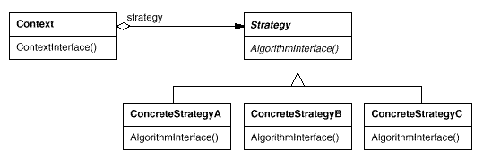

Participants

- Strategy：声明所有支持的算法通用的接口。Context 使用这个接口去调用 ConcreteStrategy 定义的算法。
- ConcreteStrategy：使用 Strategy 实现算法。
- Context：1）配置了一个 ConcreteStrategy 对象。2）维护一个 Strategy 对象的参考。3）可能定义一个接口让 Strategy 访问它的数据。

Collaborations

- Strategy 和 Context 交互以实现所选的算法。当算法调用时，Context 可能将算法需要的所有数据传递给 Strategy。或者，Context 把自己作为参数传递给 Strategy 操作。这样，Strategy 可以根据需要回调 Context。
- Context 将来自它的 Client 的请求转发给它的 Strategy。Client 通常创建和传递 ConcreteStrategy 对象给 Context。之后，Client 仅与 Context 交互。通常会有一些列的 ConcreteStrategy 类供 Client 选择。

Implementations

<details>
  <summary>Click to expand!</summary>

```java
public interface Strategy{
    public void algorithmInterface();
}
public ConcreteStrategyA implements Strategy{
    public void algorithmInterface(){
        System.out.println("algorithm implements by ConcreteStrategyA");
    }
}
public ConcreteStrategyB implements Strategy{
    public void algorithmInterface(){
        System.out.println("algorithm implements by ConcreteStrategyB");
    }
}

public class Context{
    private Strategy strategy;
    
    public contextInterface(Strategy strategy){
        this.strategy = strategy;
    }
    public void runAlgorithm(){
        this.strategy.algorithmInterface();
    }
}
public class Client{
    public static void main(String[] args){
        Strategy strategyA = new ConcreteStrategyA();
        Strategy strategyB = new ConcreteStrategyB();
        Context context = new Context();
       	context.contextInterface(strategyA);
        context.runAlgorithm();
        context.contextInterface(strategyB);
        context.runAlgorithm();
    }
}
```
</details>

### Consequences

Benefits

- 相关的算法家族。Strategy classes 的层级结构定义了一组让 Context 重用的算法或行为。
- 子类化的替代方法。你可以使用 inheritance 的方式去支持多种算法或行为。你可以 subclass Context class 直接执行不同的行为。但这将硬性地把 behavior 关联到 Context。
- Strategy 可以消除条件语句。
- 多种实现方式。

Drawbacks

- Client 必须知道 Strategies 之间的不同。这个模式有个潜在的缺点就是 Client 在选择合适的 strategy 之前必须理解 strategies 有什么不同。
- 在 Strategy 和 Context 之间有交流消耗。所有 ConreteStrategy 共享 Strategy 接口，无论它们实现的算法是简单还是复杂的。因此，某些 ConcreteStrategy 可能不适用接口传递的所有信息。这就意味着 Context 可能会创建和初始化未使用的参数。
- 它增加了对象的数量。


## Template Method
### What

在操作中定义算法的骨架，将某些步骤推迟到子类。Template Method 让子类重新定义算法的某些步骤，而无需更改算法的结构。

### Why

Motivation

通过使用抽象操作定义算法的某些步骤，模板方法可以固定其顺序，但可以让子类更改这些步骤以适合其需求。

Applicability

- 算法不变的部分仅实现一次，并将可变化的行为留给子类来实现。
- 子类间的共同行为一你改改分解并集中在一个共同类中，以避免代码重复。
- 控制子类扩展。你可以定义一个 template method，它叫做特定点调用 hook 操作，从而允许在哪些点进行扩展。

### Solution

Structure

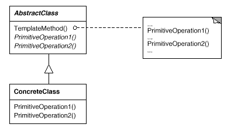

Participants

- AbstractClass：1）定义抽象的基本操作。2）实现 template method 定义算法骨架。
- ConcreteClass：实现基本操作以完成子类具体的算法步骤。

Collaborations

- ConcreteClass 依赖 AbstractClass 实现算法不变的步骤。

Implementations

<details>
  <summary>Click to expand!</summary>

```java
public abstract class AbstractClass{
    public void templateMethod(){
        primitiveOperation1();
        primitiveOperation2();
    }
    abstract void primitiveOperation1();
    abstract void primitiveOperation2();
}
public class ConcreteClass extends AbstractClass{
    public void primitiveOperation1(){
        System.out.println("operation1...");
    }
    public void primitiveOperation2(){
        System.out.println("operation2...");
    }
}
public class Client{
    public static void main(String[] args){
        AbstrctClass target = new ConcreteClass();
        target.templeateMethod();
    }
}
```
</details>

### Consequences

Benefits

- 提高代码的重用性。


## Visitor

### What

表示将在对象结构元素上执行的操作。Visitor 可以让你定义新的的操作，而无需更改其所操作的元素的类。

### Why

Motivation

将对象结构和对对象的操作分离，让你轻易的增加新的操作。

Applicability

- 一个对象结构包含很多不同接口的类的对象，你想要根据它们具体的类来执行这些对象的操作。
- 需要对一个对象结构中的对象执行许多不同且不相关的操作，并且你要避免使用这些操作“污染”它们的类。Vistor 让你将相关的操作放在一起，通过把它们定义在一个类中。
- 定义对象结构的类很少改变，但是你经常想要在该结构上定义新的操作。更改对象结构类需要重新定义所有 Visitor 的接口，这可能导致很高的花费。如果你的对象结构类经常改变，那么它可能更适合把操作定义在类中。

### Solution

Structure

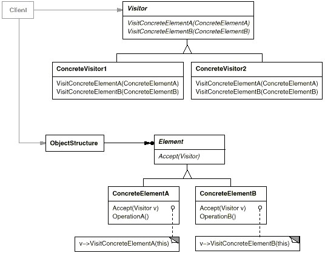

Participants

- Visitor：为对象结构中每一个 ConcreteElement 类声明一个 Visit 操作。
- ConcreteVisitor：实现 Visitor 中声明的每个操作。
- Element：定义一个 Accept 操作，它接收一个 visitor 作为参数。
- ConcreteElement：实现 Accept 操作。
- ObjectStructure：1）枚举它的元素。2）提供一个高层级的接口去允许 Visitor 访问它的元素。3）它可以是组合（Composite）或者集合（List or Set）。

Collaborations

- Client 创建一个 ConcreteVisitor 对象，然后遍历对象结构，访问 visitor 的每个元素。
- 当一个元素被访问，它调用对应的 Visitor 操作。如果需要，这个元素支持把自己作为参数传给这个操作，让 visitor 访问它的状态。

Implementations

<details>
  <summary>Click to expand!</summary>

```java
public interface Visitor{
    int visit(Element concreteElementA);
    int visit(Element concreteElementB);
}
public class ComputeSumConcreteVisitor1 implements Visitor{
    private int result = 0;
    
    public void visit(Element concreteElementA){
        result += concreteElementA.getValue();
    }
    public void visit(Element concreteElementB){
        result += concreteElementB.getValue();
    }
   	public int getSum(){
        return this.result;
    }
}
public class ComputeProductConcreteVisitor2 implements Visitor{
    private int result = 1;
    
    public void visit(Element concreteElementA){
        result *= concreteElementA.getValue();
    }
    public void visit(Element concreteElementB){
        result *= concreteElementB.getValue();
    }
   	public int getProduct(){
        return this.totalValue;
    }
}

public interface Element{
    int accept(Visitor visitor);
}
public class ConcreteElementA implements Element{
    int value;
    public ConcreteElementA(){}
    public ConcreteElementA(int value){
        this.value = value;
    }
    int accept(Visitor visitor){
        return visitor.visit(this);
    }
}
public class ConcreteElementB implements Element{
    int value;
    public ConcreteElementB(){}
    public ConcreteElementB(int value){
        this.value = value;
    }
    int accept(Visitor visitor){
        return visitor.visit(this);
    }
}

public class Client{
    pubilc static void main(String[] args){
        Element[] elements = new Element[]{new ConcreteElementA(1), new ConcreteElementB(2)};
        
        // operation 1 in elements object strucutre
        Visitor sumVisitor = new ComputeSumConcreteVisitor1();
        for (Element e : elements){
            e.accept(sumVisitor);
        }
        int sum = sumVisitor.getSum();
        
        // operation 2 in elements object strucutre
        Visitor productVisitor = new ComputeProductConcreteVisitor2();
        for (Element e : elements){
            e.accept(productVisitor);
        }
        int product = productVisitor.getProduct();
    }
}
```
</details>

### Consequences

Benefits

- Visitor 使得添加新的操作很容易。通过添加一个新的 visitor 来定义对 object 结构的新的操作。
- Visitor 收集相关的操作并将不相关的操作分开。
- 跨 class 层级结构进行访问。你可以定义没有公共父类的 visit objects。你可以在 Visitor 接口中添加任何类型的对象。
- 积累状态。

Drawbacks

- 增加新的 ConcreteElement class 是复杂的。每个ConcreteVisitor 都需要添加操作这个类的新的方法。
- 打破封装。该模式中的 element 必须提供访问元素内部状态的 public 方法。

## References

[1] Design Patterns: Elements of Reusable Object-Oriented Software by Erich Gamma, Richard Helm, Ralph Johnson and John Vlissides