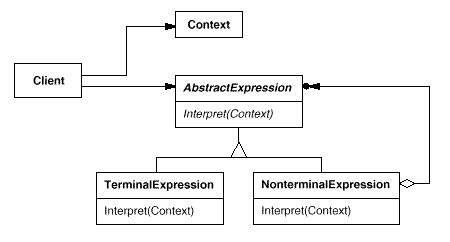

Title：设计模式（三）：行为型模式

## Chain of Responsibility
### What

通过给多个对象处理请求的机会，避免耦合请求发送者与接收者。Chain 接收请求，并沿着 chain 传递请求直到有一个对象能够处理该请求为止。

### Why

Motivation

避免将请求者与具体的接收者绑定。使用一个类统一接收所有请求，接收者连接成一条链来处理请求。

Applicability

- 超过一个对象去处理请求。
- 你想发送一个请求给一些对象中的一个，并且不明确指定接收者。
- 动态指定一组对象能处理一个请求。

### Solution

Structure

类结构


对象结构


Participants

- Handler：定义一个接口去处理请求。
- ConcreteHandler：处理请求。接收继任者（successor）。如果它能处理一个请求，则处理它；如果不能，则转发这个请求给它的继任者。
- Client：初始化一个请求给 chain 上的一个 ConcreteHandler 对象。

Collaborations

- 当 Client 发送一个请求，这个请求在 Chain 上传播，直到有一个 ConcreteHandler 对象能够处理它。

Implementations

<details>
  <summary>Click to expand!</summary>

```java
public abstract class Handler{
    private Handler nextHandler;
    
    public abstract void handleRequest();
    
    public void setNext(Handler handler){
        this.nextHandler = handler;
    }
}

public class ConcreteHandler1 extends Handler{
    public void handleRequest(int request){
        if (request == 1){
            System.out.println("handle by ConcreteHandler1");
        }else{
            if (nextHandler != null)
                nextHandler.process(request);
        }
    }
}

public class ConcreteHandler2 extends Handler{
    public void handleRequest(int request){
        if (request == 2){
            System.out.println("handle by ConcreteHandler2");
        }else{
            if (nextHandler != null)
                nextHandler.process(request);
        }
    }
}

public class Client{
    public static void main(String[] args){
        Handler handler = new ConcreteHandler1();
        Handler nextHandler = new ConcreteHandler2();
        handler.setNext(nextHandler);
        handler.handleRequest(1);
        handler.handleRequest(2);
    }
}
```
</details>

### Consequences

Benefits

- 减少了耦合。
- 增加了分配职责给对象的灵活性。

Drawbacks

- 接收不能保证。因为一个请求没有明确指定接收者，所有不能保证它能被处理。

## Command

### What

封装一个请求作为一个对象，因此让你参数化客户端的不同请求。

### Why

Motivation

有时需要发送一个请求给对象，但不知道任何关于请求的操作或者请求的接收者。

Applicability

- 参数化执行动作作为对象。
- 在不同的时间指定，排队和执行请求。Command 对象的生命周期可以独立于原始请求。
- 支持 undo。Command 执行操作可以存储状态用来反转影响 command 本身。
- 支持 logging changes。所以可以在系统崩溃后可以重新正确运行。
- 围绕基于 primitive 操作的 high-level 操作来构建系统。

### Solution

Structure


Participants

- Command：为执行一个操作声明一个接口。
- ConcreteCommand：定义一个在 Receiver object 和 action 的绑定。通过调用接收者相应的操作来实现 Execute。 
- Cient：创建一个 ConcreteCommnd object，以及设置它的 receiver。
- Invoker：请求 command 得到请求结果。
- Receiver：知道如何执行与请求相关的操作。

Collaborations

- Client 创建一个 ConcreteCommand 以及指定它的 receiver。
- Invoker 对象存储 ConcreteCommand 对象。
- Invoker 通过调用 command 对象的 execute() 方法就，发出请求。
- ConcreteCommand 对象调用接收者的操作得到请求结果。

Implementations

<details>
  <summary>Click to expand!</summary>

```java
public interface Command{
    void execute();
}
public class Receiver{
    public void action1(){
        System.out.println("action 1 executing...");
    }
    public void action2(){
        System.out.println("action 2 executing...");
    }
}
public class ConcreteCommand1 implements Command{
    public Receiver receiver;
    public ConcreteCommand1(Receiver receiver){
        this.receiver = receiver;
    }
    public void execute(){
        receiver.action1();
    }
}
public class ConcreteCommand2 implements Command{
    public Receiver receiver;
    public ConcreteCommand1(Receiver receiver){
        this.receiver = receiver;
    }
    public void execute(){
        receiver.action2();
    }
}
public class Invoker{
    Command slot;
    public void setCommand(Command command){
        this.slot = command;
    }
    public void requestExecute(){
        this.slot.execute();
    }
}
public class Clinet{
    Invoker invoker = new Invoker();
    Receiver receiver = new Receiver();
    invoker.setCommnad(new ConcreteComand1(receiver));
    invoker.requestExecute();
    invoker.setCommnad(new ConcreteComand2(receiver));
    invoker.requestExecute();
}
```
</details>

### Consequences

Benefits

- 请求命令是很灵活的。
- 支持 undo 和 redo。Command 可以提供一个方式去反转它的执行。
- 避免在 undo 过程中错误积累。

Drawbacks


## Interpreter

### What

给定一种语言，定义其语法表示形式，以及使用该表示形式来解释语言中的句子。

### Why

Motivation

如果一个种特殊的问题经常发生，它可能值得用简单的语言将问题的实例表达为句子。然后，你可以构建 interpreter 通过解释这些句子来解决问题。

Applicability

- 语法是简单的。
- 效率不是一个关键问题。

### Solution

Structure



Participants

- AbstractExpression：定义一个抽象 interpret 操作，它存在于所有 abstract syntax tree 中的节点。
- TerminalExpression：实现与 terminal symbols 有关的 interpret 操作。
- NonterminalExpression：实现 nonterminal symbols 相关的 interpret 操作。
- Context：包含给 interpreter 的全部信息。
- Client：构建一个抽象的 syntax tree 表示一个符合语法规定的特定的句子。调用 interpret 操作。

Collaborations

- Client 构建一个句子作为 NonterminalExpression 和 TerminalExpression 实例的abstract syntax tree 。然后，client 初始化 context，调用 interpret 操作。
- 每个 NonterminalExpression node 定义了 interpret 对每个子表达式上的 interpret。
- 每个 node 的 interpret 操作使用 context 去存储和访问 interpreter 的 state。

Implementations

<details>
  <summary>Click to expand!</summary>

```java
public interface Expression{
    boolean interpret(String context);
}

public class TerminalExpression implements AbstractExpression{
    private String data;
    public TerminalExpression(String data){
        this.data = data;
    }
    public boolean interpret(Context context){
        if (data.contains(Context.data)){
            return true;
        }else{
            return false;
        }
    }
}
public class NonTerminalExpression implements AbstractExpression{
    private Expression expression1;
    private Expression expression2;
    public NonTerminalExpression(Expression expression1, Expression expression2){
        this.expression1 = expression1;
        this.expression2 = expression2;
    }
    public boolean interpret(Context context){
        return expression1.interpret(context) && expression2.interpret(context);
    }
}
public class Context{
    private String data;
    public Context(String data){
        this.data = data;
    }
}

public class Client{
    Context context1 = new Context("Tom");
    TerminalExpression terminalExp1 = new TerminalExpression("Tom");
    TerminalExpression terminalExp2 = new TerminalExpression("Jack");
    terminalExp1.interpret(context1);
    terminalExp2.interpret(context1);
    NonTerminalExpression nonTerminalExp = new NonTerminalExpression(terminalExp1, terminalExp2);
    nonTerminalExp.interpret(context1);
}
```
</details>

### Consequences

Benefits

- 它很容易去改变和扩展语法。
- 实现语法是容易的。
- 可以增加新的方式去 interpret 表达式。

Drawbacks

- 复杂的语法很难去管理和维护。


## Iterator

### What

提供以一种方式去顺序地访问聚合对象地元素，而不暴露它的底层表示。

### Why

Motivation

一个聚合对象如 list，应该有一种方式去访问它的元素而不暴露它的内部结构。你可能想要用不用地方式去遍历集合，取决于你想要的实现。Iterator 模式可以帮你完成以上功能。

Applicability

- 访问一个聚合对象的内容，而不暴露它的内部表示。
- 支持多种对聚合对象的遍历方式。
- 提供统一的接口去遍历不同的聚合数据结构。

### Solution

Structure


Participants

- Iterator：定义一个接口去访问和遍历元素。
- ConcreteIterator：实现 Iterator 接口。保持追踪遍历聚合元素的位置。
- Aggregate：定义创建 Iterator 对象的接口。
- ConcreteAggregate：实现创建 Iterator 对象接口，返回合适的 ConcreteIterator 对象。

Collaborations

- ConcreteIterator 保持聚合元素对象的轨迹，能够计算在遍历中接下的元素对象。

Implementations

<details>
  <summary>Click to expand!</summary>

```java
public interface Aggregate{
    Iterator createIterator();
}
public class ConcreteAggregate implements Aggregate{
    private int[] data = new int[32];
    private int size;
    private int currentSize;
    
    public void add(int number){
        data[currentSize] = number;
        currentSize++;
    }
    
    public Iterator createIterator(){
        return new ConcreteIterator(data, currentSize);
    }
}

public interface Iterator{
    int first();
    void next();
    boolean isDone();
    int currentItem();
}
public class ConcreteIterator implements Iterator{
    private int[] data;
    private int cursor = 0;
    
    public ConcreteIterator(int[] data, int currentSize){
        data = new int[currentSize];
        for (int i = 0; i < currentSize; i++){
            this.data[i] = data[i];
        }
    }
    
    public int first(){
        // TODO
        return null;
    }
    public int next(){
        if (cursor < data.length){
            return data[cursor++];
        }else{
            throw new ArrayIndexOutOfBoundExcpetion();
        }
    }
    public boolean isDone(){
        return cursor >= data.length -1;
    }
    public int currentItem(){
        // TODO
        return null;
    }
}

public class Client{
    public static void main(String[] args){
        Aggregate aggregate = new ConcreteAggregate();
        aggregate.add(1);
        Iterator iterator = aggregate.createIterator();
        while(! iterator.isDone()){
            System.out.println(iterator.next());
        }
    }
}
```
</details>

### Consequences

Benefits

- 它支持聚合结构的遍历的变化。
- Iterator 简化了 Aggregate 接口。
- 多个 traversal 可以在聚合结构等待的。


## Mediator

### What

### Why

Motivation

Applicability

### Solution

Structure


Participants

Collaborations

Implementations

<details>
  <summary>Click to expand!</summary>

```java
todo
```
</details>

### Consequences

Benefits

Drawbacks

## Memento

### What

### Why

Motivation

Applicability

### Solution

Structure


Participants

Collaborations

Implementations

<details>
  <summary>Click to expand!</summary>

```java
todo
```
</details>

### Consequences

Benefits

Drawbacks


## Observer
### What

### Why

Motivation

Applicability

### Solution

Structure


Participants

Collaborations

Implementations

<details>
  <summary>Click to expand!</summary>

```java
todo
```
</details>

### Consequences

Benefits

Drawbacks


## State
### What

### Why

Motivation

Applicability

### Solution

Structure


Participants

Collaborations

Implementations

<details>
  <summary>Click to expand!</summary>

```java
todo
```
</details>

### Consequences

Benefits

Drawbacks


## Strategy
### What

### Why

Motivation

Applicability

### Solution

Structure


Participants

Collaborations

Implementations

<details>
  <summary>Click to expand!</summary>

```java
todo
```
</details>

### Consequences

Benefits

Drawbacks


## Template Method
### What

### Why

Motivation

Applicability

### Solution

Structure


Participants

Collaborations

Implementations

<details>
  <summary>Click to expand!</summary>

```java
todo
```
</details>

### Consequences

Benefits

Drawbacks


## Visitor

### What

### Why

Motivation

Applicability

### Solution

Structure


Participants

Collaborations

Implementations

<details>
  <summary>Click to expand!</summary>

```java
todo
```
</details>

### Consequences

Benefits

Drawbacks