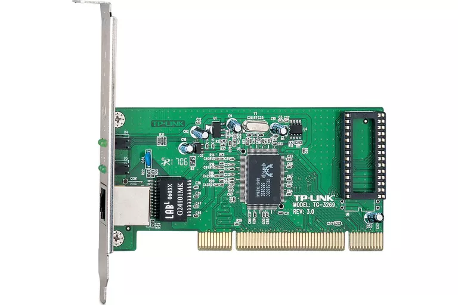

> A Network Interface Controller (NIC, also known as a network interface card, network adapter, LAN adapter or physical network interface, and by similar terms) is a computer hardware component that connects a computer to a computer network. 
>
> - Wikipedia

网络接口控制器，也称网卡（Network Card），网络适配器（Network Adapter）。

### References

[Network interface controller - Wikipedia](https://en.wikipedia.org/wiki/Network_interface_controller)