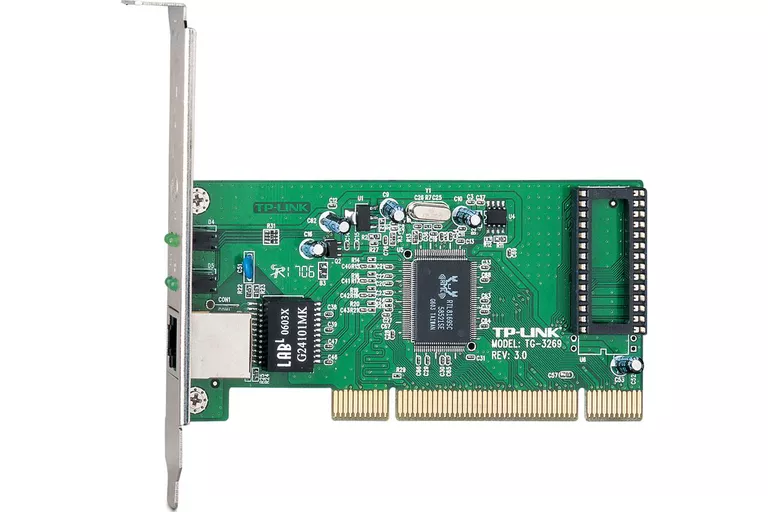
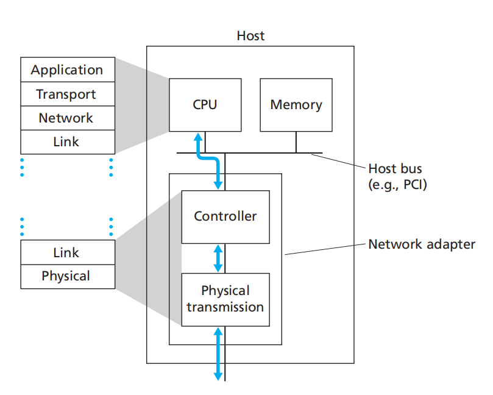

Content

- Introduction
  - Services
  - Link layer implement location
- Error detection and correction
  - Parity check
  - Checksum
  - CRC
- Multiple Access Link and Protocols
- Local Area Networks
  - Link Layer Addressing and ARP
  - Ethernet Protocol
  - Link Layer Switch Operate
  - Build Large-scale LANs
- Link Virtualization

### Main

## 介绍链路层

两个相邻的连接的节点之间的通信路径称为链路。任何设备运行一个链路层协议称为一个节点。链路层的主要功能是通过把网络层的数据报封装为链路层的帧（Frame）在链路上传播，将网络层数据报从一个节点传输到另一个相邻的节点。

### 链路层提供的服务

- 封装。将网络层的数据报封装成链路层的帧。
- 链路接入。
- 不可靠数据传输。
- 错误侦测和纠正。

### 链路层的硬件组成

网络接口控制器（Network Interface Controller，NIC），也称网卡（Network Card），网络适配器（Network Adapter），局域网适配器，物理网络接口等等。它是一个计算机的硬件组件，它连接了计算机和计算机网络。本篇主要使用网络适配器作为名称，网络适配器的外观如下图所示。

在一台主机中应用层、传输层和网络层都是软件组件，而链路层一部分是软件组件，一部分是硬件组件。网络协议栈与主机软件和硬件组件之间的关系如下图所示。

链路层软件组件主要和网络层交互。在客户端组装链路层寻址信息，激活网络适配器；在服务端响应网络适配器的 interrupt 信号，传递数据报给网络层。硬件组件功能是错误侦测，以及物理层交互。

## 错误检测与纠正

### 奇偶校验

### 检验和

### 循环冗余校验

## 多点连接链路

### 

## 局域网

### 链路层寻址和 ARP 协议

### 以太网协议

### 链路层交换机

### References

[1] Computer Networking: A Top-Down Approach, by Jim Kurose

[2] [Network interface controller - Wikipedia](https://en.wikipedia.org/wiki/Network_interface_controller)